```{r}
#| echo: false
#| message: false
#| warning: false

pacman::p_load(dplyr, readr)

sd <- read_csv("../salario_digno.csv")

fmt <- function(x) format(round(x, 2), big.mark = ",", nsmall = 2)

sd_nac_urb <- sd |> filter(nom_ent == "Nacional", ambito == "Urbano") |> pull(salario_digno)
sd_nac_rur <- sd |> filter(nom_ent == "Nacional", ambito == "Rural")  |> pull(salario_digno)
sd_max     <- sd |> filter(nom_ent != "Nacional") |> slice_max(salario_digno, n = 1)
sd_min     <- sd |> filter(nom_ent != "Nacional") |> slice_min(salario_digno, n = 1)
```

# Glosario {#sec-glosario}

**ARI**: Anker Research Institute (Instituto Anker).

**CADI**: Centro Asistencial de Desarrollo Infantil.

**CDESC**: Comité de Derechos Económicos, Sociales y Culturales (de la ONU).

**CDMX**: Ciudad de México.

**CENDI**: Centro de Desarrollo Infantil.

**CEPAL**: Comisión Económica para América Latina y el Caribe.

**Conasami**: Comisión Nacional de los Salarios Mínimos.

**Conavi**: Comisión Nacional de Vivienda.

**Coneval**: Consejo Nacional de Evaluación de la Política de Desarrollo Social.

**CPEUM**: Constitución Política de los Estados Unidos Mexicanos.

**DUDH**: Declaración Universal de los Derechos Humanos.

**ENIGH**: Encuesta Nacional de Ingresos y Gastos de los Hogares.

**FAO**: Organización de las Naciones Unidas para la Alimentación y la Agricultura.

**INEGI**: Instituto Nacional de Estadística y Geografía.

**Infonavit**: Instituto del Fondo Nacional de la Vivienda para los Trabajadores.

**INPC**: Índice Nacional de Precios al Consumidor.

**ISR**: Impuesto Sobre la Renta.

**LOESS**: regresión local ponderada (*locally estimated scatterplot smoothing*).

**LPEI**: Línea de Pobreza Extrema por Ingresos.

**MIS**: *Minimum Income Standard* (Estándar de Ingreso Mínimo).

**MIT**: *Massachusetts Institute of Technology* (en *MIT Living Wage Calculator*).

**NANV**: No Alimentos y No Vivienda.

**NAU**: Nueva Agenda Urbana.

**NOM**: Norma Oficial Mexicana.

**ODS**: Objetivos de Desarrollo Sostenible.

**OIT**: Organización Internacional del Trabajo.

**OMS**: Organización Mundial de la Salud.

**ONU**: Organización de las Naciones Unidas.

**ONU-Hábitat**: Programa de las Naciones Unidas para los Asentamientos Humanos.

**PIB**: Producto Interno Bruto.

**PIDESC**: Pacto Internacional de Derechos Económicos, Sociales y Culturales.

**SCAM**: modelos aditivos con restricción de forma (*Shape-Constrained Additive Models*).

**SINCO**: Sistema Nacional de Clasificación de Ocupaciones.

**UNU**: Universidad de las Naciones Unidas (*United Nations University*).

# Introducción

Como parte del mandato constitucional de la Conasami se encuentra la máxima responsabilidad de *fijar un salario mínimo que permita satisfacer las necesidades normales de un jefe \[una jefa\] de familia, en orden material, social y cultural, y para proveer a la educación obligatoria de sus hijas o hijos*. Por ello, la Conasami se comprometió a la construcción de una Canasta Digna con el objetivo de establecer un umbral monetario suficiente para satisfacer las condiciones de una vida digna. La Canasta se elaboró adaptando la metodología de estimaciones subnacionales de salarios dignos de Richard y Martha Anker, junto con la metodología para la estimación de líneas de pobreza establecida por la CEPAL.

La Canasta Digna es el primer paso de un esfuerzo para la evaluación de las condiciones de vida de las personas trabajadoras en México, siguiendo criterios transparentes y una metodología con rigor técnico. En ese sentido, la metodología se distingue conceptualmente de otras centradas en la medición unidimensional y multidimensional de la pobreza, pues no busca estimar umbrales mínimos de vida, sino que parte de estándares internacionales para evaluar el cumplimiento de las dimensiones que conforman una vida digna. Esta vida digna se entiende como el tener las condiciones materiales para la satisfacción de las necesidades de las y los jefes de familia establecidos en la CPEUM, convirtiéndose en una herramienta distinta a las que se han utilizado en la arena pública del país.

Bajo este enfoque, se busca estimar el monto de un salario digno en el país que, junto con el correspondiente impuesto, represente el pago que recibe una persona trabajadora por un periodo regular de trabajo en una entidad determinada y que le permite a él o a ella y a su familia tener un estándar de vida digna. Así, el trabajo y, en particular, la remuneración justa de las actividades de las personas trabajadoras son el concepto central de la concepción de una vida digna manejada en este documento.

Para obtener el monto correspondiente a un salario digno se establece una Canasta Digna, que está compuesta por una suma estimada del gasto considerado digno en tres rubros: 1) Alimentos; 2) Vivienda y, 3) No Alimentos y No Vivienda (NANV); más un porcentaje para ahorro o emergencias y las deducciones del ISR correspondientes (vigentes y alineadas a leyes de México).

Se estimó una canasta representativa para cada uno de los rubros anteriores: una Canasta de Alimentos que se define como el gasto en alimentos de un estrato poblacional de referencia que se asume tiene una alimentación digna; una Canasta de Vivienda que estima el gasto en viviendas que cumplen con los criterios de dignidad establecidos por ONU-Hábitat; y una Canasta de NANV que engloba los gastos en rubros varios como salud, educación y recreación.

A diferencia de los ejercicios previos para México, concentrados en zonas productoras específicas o en una sola ciudad, esta estimación cubre las 32 entidades federativas en sus ámbitos urbano y rural, así como su estimación nacional, y es reproducible en su totalidad a partir de microdatos públicos de la ENIGH 2024. Con ello se busca dotar a la Conasami de un instrumento técnico para informar la progresión gradual del salario mínimo hacia el salario digno que ordena la Constitución.

El valor estimado del Salario Digno fue de `r fmt(sd_nac_urb)` y `r fmt(sd_nac_rur)` pesos mensuales netos, a precios de agosto de 2024 – fecha de levantamiento de la ENIGH 2024 – a nivel nacional para el ámbito urbano y rural, respectivamente. A nivel entidad, el mayor monto estimado fue en el ámbito `r tolower(sd_max$ambito)` en el estado de `r sd_max$nom_ent` con `r fmt(sd_max$salario_digno)` pesos netos. En contraste, el menor fue en el ámbito `r tolower(sd_min$ambito)` de `r sd_min$nom_ent` con `r fmt(sd_min$salario_digno)` pesos netos. Estos montos representan la suma necesaria de dinero que una persona trabajadora debe percibir para cubrir sus necesidades en todos los órdenes y las de una persona dependiente en cada entidad y ámbito.

Una ventaja adicional de la metodología propuesta, particularmente relevante para el caso de México, es que sus estimaciones pueden actualizarse periódicamente, en concordancia con los principios para la estimación de salarios vitales adoptados por la OIT, que llaman a revisar los montos con regularidad para mantener su vigencia [@ilo2024conclusiones]. Los montos pueden actualizarse con el INPC del INEGI para conservar su valor real entre levantamientos, de modo que la Canasta Digna disponga de un valor puntual a precios de cada mes. Adicionalmente, la publicación bienal de la ENIGH permite reestimar las Canastas conforme cambian las condiciones de bienestar y los patrones de consumo de las personas trabajadoras del país, capturando modificaciones en los precios relativos, la composición del gasto y los estándares de una vida digna que un ajuste por precios no alcanza a reflejar.

La estimación enfrenta limitaciones derivadas del uso de la ENIGH como fuente de información, sin implicaciones negativas para las cifras reportadas. Primero, la desagregación de la Canasta Digna solo es posible hasta el nivel en que la encuesta conserva representatividad estadística, esto es la entidad federativa y el ámbito urbano o rural. Por lo tanto, no es posible estimar un salario digno para unidades más desagregadas, como municipios o grupos ocupacionales específicos. Segundo, si bien las condiciones y características que definen una vivienda adecuada varían entre las zonas y regiones del país, no es posible definir confiablemente ese nivel de granularidad con los datos de la ENIGH. Aquí se aplican los mismos criterios de ONU-Hábitat en todas las entidades y ámbitos.

El texto se organiza de la siguiente forma: la siguiente sección revisa la literatura sobre salarios dignos, sus elementos de consenso y los antecedentes empíricos para México. A continuación, se expone la metodología, la representatividad estadística de la ENIGH 2024 y la selección del hogar de referencia. Después se presentan los resultados de cada componente de la Canasta Digna (alimentos, vivienda y NANV) y el cálculo del salario digno. La última sección concluye.

# Revisión de literatura

Aunque los salarios dignos son ampliamente reconocidos como un derecho humano[^1], e incluso como una condición necesaria para alcanzar una paz universal y duradera[^2], no existe un consenso sobre su definición ni sobre la forma precisa de estimarlos. El lenguaje empleado para definirlos suele ser ambiguo, sin embargo, esto no impide que exista un acuerdo sustantivo sobre los elementos que conforman un salario digno ni sobre los principios que deben guiar su estimación [@anker2017livingwages; @ilo2024conclusiones]. En esta sección se describen los componentes que conforman un salario digno, los atributos que una metodología para su estimación debe satisfacer y algunos ejemplos de estimaciones realizadas para países en vías de desarrollo y para México.

[^1]: Consagrado en instrumentos internacionales como la DUDH [@un1948declaracion] y el PIDESC, y reafirmado por la OIT desde su Constitución de 1919 hasta la Declaración del Centenario de 2019 [@ilo2024conclusiones].

[^2]: Tal como lo establece el preámbulo de la Constitución fundacional de la OIT (1919), que reconoce a la justicia social como cimiento indispensable de la paz [@reynaud2017historical; @marinakis2008minimumwage].

## El salario digno como derecho y condición para el desarrollo

El reconocimiento del salario digno como derecho humano se da en múltiples convenciones y acuerdos internacionales. Por ejemplo, el artículo 23.3 de la DUDH consagra el derecho de toda persona que trabaja a "una remuneración equitativa y satisfactoria, que le asegure, así como a su familia, una existencia conforme a la dignidad humana" [@un1948declaracion]. El artículo 7 del PIDESC indica que se debe reconocer el derecho de "condiciones de existencia dignas" para la persona trabajadora y su familia. Por su parte, la OIT lo reconoce desde su Constitución de 1919, que llama a alcanzar "un salario vital adecuado", lo reafirma en la Declaración de Filadelfia (1944) y lo reincorpora en la Declaración del Centenario para el Futuro del Trabajo (2019) [@ilo2024conclusiones; @reynaud2017historical]. Para estos casos, se establece como visión que el trabajo humano no debe ser considerado una mercancía [@reynaud2017historical], sino un elemento inseparable de la dignidad humana; es, por lo tanto, un insumo que debe estar fuera de las reglas del mercado, y los salarios, por ser la fuente esencial del bienestar de las personas trabajadoras, deben ser suficientes para proveer de una vida digna para ellas y sus familias.

Esta lectura del salario como condición necesaria que permite la dignidad de las personas trabajadoras se relaciona con el enfoque de capacidades de Amartya Sen y con el de desarrollo como derechos humanos. En *Desarrollo y libertad* [@sen1999development], se plantea la necesidad de conceptualizar el desarrollo como la expansión de las libertades sustantivas del individuo. De esta forma, el desarrollo no depende únicamente de indicadores agregados como el PIB, los ingresos per cápita o del nivel de desarrollo industrial o tecnológico de un país; lo hace, incluso en mayor medida, de arreglos sociales y económicos que permiten el libre ejercicio y disfrute de los derechos políticos y sociales de un individuo en la sociedad. Por lo tanto, el desarrollo requiere eliminar las fuentes de todo aquello que limite este ejercicio de derechos. Así, la pobreza laboral es uno de los mayores retos a los que se enfrentan las naciones en su proceso de búsqueda de mayores libertades individuales. La distinción entre bienes (lo que se posee), capacidades (lo que se *puede* ser o hacer con esos bienes) y funcionamientos (lo que efectivamente se logra) tiene una implicación directa para la estimación del Salario Digno: los bienes y servicios que lo componen (alimentos, vivienda, NANV) no son fines en sí mismos, sino los insumos materiales que permiten la posibilidad del libre ejercicio de los derechos. Lo que se declara en la CPEUM como necesidades de "orden material, social y cultural" no son tres rubros de gasto, sino tres dimensiones de las libertades sustantivas que el salario digno debería permitir alcanzar[^3].

[^3]: Este enfoque justifica decisiones operativas de la metodología que se expone más adelante. Por ejemplo, emplear estratos de referencia que, con cierta confianza estadística, *ya cumplen* condiciones de bienestar; apoyarse en estándares normativos, como los de ONU-Hábitat para vivienda, antes que en promedios observados sobre las características de las viviendas; priorizar que sean los hogares de referencia los que revelen el patrón de consumo, mas no el precio, compatible con la dignidad.

## Definiciones y elementos en consenso

El concepto de salario digno no es nuevo, incluso aparece en debates de política salarial desde el siglo XX [@reynaud2017historical] y atraviesa al desarrollo institucional de la OIT desde la Conferencia de París de 1919 hasta el Convenio núm. 131 de 1970 [@reynaud2017historical; @marinakis2008minimumwage]. El renovado interés responde a una nueva preocupación de diversos actores globales: la caída sostenida de la participación laboral en el producto nacional de buena parte de los países y la proliferación de iniciativas de gobernanza corporativa, certificación y negociación salarial que demandan un referente operativo del salario digno [@anker2017livingwages; @ilo2024conclusiones].

La definición adoptada por consenso tripartito en la Reunión de Expertos sobre Políticas Salariales de la OIT de febrero de 2024 [@ilo2024conclusiones] establece que un salario digno es:

> *El nivel salarial necesario para proporcionar un nivel de vida digno a \[las y\] los trabajadores y sus familias, teniendo en cuenta las circunstancias del país, y calculado como contraprestación por el trabajo efectuado durante las horas normales de trabajo.*

A partir de esta definición y de la sistematización previa de Anker & Anker [-@anker2017livingwages], los siguientes ocho puntos representan los elementos de consenso sobre lo que constituye un salario digno:

1.  **Es un derecho humano** reconocido por la comunidad internacional, por la DUDH, el PIDESC y la Constitución de la OIT.
2.  Representa el monto suficiente para alcanzar un **estándar de vida considerado decente**, por encima del mínimo de subsistencia.
3.  Es **apropiado para la sociedad y el momento**, es decir, relativo al contexto nacional y temporal.
4.  Es **salario neto**, lo que efectivamente recibe la persona trabajadora tras impuestos y contribuciones sociales.
5.  Debe ser suficiente para **la persona trabajadora y su familia**, no solo para un individuo.
6.  Se obtiene por **horas normales de trabajo**, excluyendo horas extraordinarias.
7.  La canasta de referencia debe incluir, como mínimo, **alimentación, vivienda, salud, educación y otros bienes y servicios** necesarios según las circunstancias del país.
8.  La metodología debe ser **transparente, reproducible, basada en evidencia empírica representativa y ajustada periódicamente** para reflejar cambios en el costo de vida y los patrones de consumo.

## Dimensiones donde no hay consenso

En cambio, no existe acuerdo único sobre la operacionalización de esos elementos. Las metodologías difieren, de manera deliberada o circunstancial, en al menos las siguientes dimensiones:

- **Tamaño y composición del hogar de referencia.** Varía según el país y estudio.
- **Número de perceptores por hogar.** Va de un solo proveedor a dos.
- **Margen para ahorro y contingencias.** Oscila entre 5% y 10% adicional, según la metodología elegida.
- **Ajustes normativos al gasto observado.** Algunas estimaciones excluyen tabaco, transporte privado o un porcentaje de los alimentos consumidos fuera del hogar, otras se abstienen para no introducir juicios de valor.
- **Cuantil o estrato de referencia.** Datos de fuentes primarias, como entrevistas o grupos focales, o de fuentes secundarias como la mediana poblacional, percentil 70 del gasto en alimentos o estratos definidos por indicadores de consumo calórico, entre otros.
- **Estructura del componente de vivienda.** Renta efectivamente pagada, renta imputada para propietarios o costo de construcción, con diferencias relevantes en países con alta proporción de vivienda en propiedad.
- **Reporte bruto o neto.** Ambas convenciones coexisten en la literatura y, cuando no se documenta cuál se emplea, las cifras dejan de ser comparables.

## El consenso operativo: Reunión de expertos OIT 2024

En febrero de 2024, la Reunión Tripartita de Expertos sobre Políticas Salariales, Incluidos los Salarios Vitales, alcanzó un consenso tripartito sobre la definición del salario vital[^vital-digno] y los principios que deben guiar su estimación [@ilo2024reuexpertos; @ilo2024conclusiones].

[^vital-digno]: Salario vital y digno son usados indistintamente a lo largo del texto. Las conclusiones de la reunión establecen diez principios metodológicos que toda estimación de salario vital debería satisfacer:

a)  basarse en estimaciones empíricas de las necesidades de las personas trabajadoras y sus familias;
b)  incluir consulta con las organizaciones representativas de personas empleadoras y trabajadoras;
c)  ser transparente en fuentes de datos y métodos de procesamiento;
d)  descansar en datos sólidos en representatividad y métodos de recopilación;
e)  garantizar la disponibilidad pública oportuna de estimaciones, datos y metodología;
f)  indicar explícitamente si las estimaciones son brutas o netas;
g)  prever ajustes periódicos para reflejar cambios en el costo de vida y los patrones de consumo;
h)  someter el procedimiento a control de calidad y revisión periódica;
i)  promover la igualdad de género y la no discriminación, y
j)  considerar el contexto regional o local y las realidades socioeconómicas y culturales.

Las diferencias en la aplicación operacional del salario digno provienen de la dificultad para alcanzar un consenso sobre qué condiciones materiales definen una vida digna[^4]. La definición adoptada por consenso tripartito en 2024 señala que el nivel salarial necesario se calcula «teniendo en cuenta las circunstancias del país» [@ilo2024conclusiones]. Por lo tanto, una cuantificación monetaria exige tomar decisiones sustantivas en cada una de las dimensiones en las que no hay consenso, listadas anteriormente. El estándar de transparencia que la OIT exige a las estimaciones consiste, precisamente, en explicitar y justificar cada una de esas elecciones, pues la diversidad de contextos nacionales hace que un enfoque único resulte insuficiente [@anker2017livingwages; @ilo2024conclusiones].

[^4]: Esta dificultad es constitutiva del concepto; desde los acuerdos fundacionales de la OIT en 1919, quedó explícito que cualquier cuantificación monetaria debe atender las circunstancias particulares de cada país [@reynaud2017historical]

La metodología que aquí se expone se diseñó con apego explícito a estos principios. La transparencia y reproducibilidad se aseguran al publicar el código y la documentación del proyecto; la solidez de los datos descansa en el uso exclusivo de la ENIGH 2024 a cargo del INEGI, instituto oficial de estadística del país; el reporte bruto-neto se documenta de forma desagregada en los resultados; y la consideración del contexto local se materializa en estimaciones diferenciadas por entidad federativa y ámbito urbano-rural, dadas las diferencias en el costo de vida. Adicionalmente, la metodología presentada ha considerado los comentarios de otros actores institucionales de la administración pública federal mexicana, como del INEGI, así como del Consejo de Representantes de la Conasami, que es un órgano de representación tripartita.

## Aplicación en México: el mandato constitucional y antecedentes empíricos

### El mandato constitucional

México cuenta con un mandato constitucional explícito que antecede por más de un siglo la actual definición tripartita de la OIT. El artículo 123, apartado A, fracción VI, de la CPEUM establece que los salarios mínimos "deberán ser suficientes para satisfacer las necesidades normales de un jefe \[una jefa\] de familia, en el orden material, social y cultural, y para proveer a la educación obligatoria de los hijos \[e hijas\]". Este fraseo contiene tres rasgos relevantes. Primero, define el salario mínimo como un instrumento de suficiencia, no de subsistencia, es decir, las necesidades por satisfacer son las "normales" de una familia, no las indispensables para la mera supervivencia. Segundo, es multidimensional: identifica explícitamente lo material, lo social y lo cultural como dimensiones que el salario debe permitir. Tercero, incorpora la educación de las hijas y los hijos como un componente fundamental, reconociendo que un salario digno es fundamentalmente un concepto para un hogar (no un individuo) y que debe ser suficiente para todas las personas que le integran.

De este mandato se desprende una implicación operativa para la Comisión: en México, el salario digno no es un elemento opcional al salario mínimo, sino el horizonte normativo que el salario mínimo legal debería alcanzar. Esta interpretación es consistente con los principios del consenso de expertos de la OIT, que llama a "la promoción de la progresión gradual de salarios mínimos a salarios vitales" [@ilo2024conclusiones] y los principios establecidos para el uso de los salarios mínimos como instrumentos de política pública [@ilo2025economicfactors; @marinakis2008minimumwage]. La estimación del Salario Digno que aquí se documenta constituye, en este sentido, el primer paso técnico para hacer operativa esa progresión gradual.

### Antecedentes empíricos: estudios previos en países en desarrollo y en México

La estimación de salarios dignos en países en desarrollo ha seguido caminos diversos. En su revisión sistemática de las metodologías existentes, @anker2011methodology las clasifica en tres tipos según la fuente de datos. El primero parte de datos específicos del país, por lo general encuestas nacionales de ingreso y gasto, para estimar el costo de una vida digna a nivel nacional, regional o de ciudad. El segundo descansa en datos recabados directamente entre las personas trabajadoras de una o varias firmas, que es un enfoque acotado a estudios sectoriales o regionales, y usualmente prohibitivamente costoso para los gobiernos. El tercero extrapola el costo de vida observado en un solo país hacia el resto de las economías en desarrollo, con los problemas de comparabilidad que ello supone. De los tres, el primero es el más cercano al enfoque que adopta este trabajo, siguiendo el objetivo de una estimación nacional, por entidad y ámbito.

La metodología Anker se ha consolidado como el referente internacional para la medición de salarios dignos [@anker2017livingwages]. El ARI produce estimaciones mediante tres procedimientos con costos y alcances distintos.

El primero son los **estudios de referencia** (*benchmark*) que constituyen el estándar de oro de la metodología y estiman, para una localidad específica, el costo de una vida digna a partir de una combinación de datos primarios y secundarios. Por ejemplo, encuestas y entrevistas de campo, levantamiento de precios, normas nutricionales de la OMS y estándares de vivienda nacionales e internacionales. Cada estudio estima por separado el costo de alimentación, vivienda y demás rubros, lo divide entre el número de personas trabajadoras de tiempo completo que sostienen al hogar, y añade los impuestos y contribuciones correspondientes. Las decisiones para las dimensiones sin consenso del salario digno (tamaño del hogar, número de trabajadores, etc.) las toman basándose en la información primaria recopilada y en consenso con los actores involucrados. Su precisión implica un costo elevado, pues requieren personas investigadoras independientes, trabajo de campo y un proceso estricto de aseguramiento de calidad, lo que limita el número de localidades y países que pueden cubrirse.

El segundo son los **valores de referencia** (*reference values*), que responden a la demanda creciente de estimaciones cuando no existe un estudio *benchmark* disponible. En lugar de levantar información en campo, este procedimiento ajusta un modelo de regresión multivariada sobre los resultados de 40 estudios *benchmark* realizados en 23 países en desarrollo, y relaciona el salario digno neto con características nacionales tomadas de fuentes públicas y comparables como el Banco Mundial, la OIT, la FAO y la ONU. El modelo permite predecir un valor para cualquier país en desarrollo, con cifras separadas para los ámbitos urbano y rural, aunque sin desagregación por localidad. Su margen de error ronda 10% para el promedio urbano o rural de un país y se amplía a cerca de 35% para localidades específicas. Son mucho más baratos de producir y se actualizan cada año, a costa de una menor precisión local.[^5]

[^5]: El procedimiento se describe en una nota técnica interna del ARI (Anker, Anker y Prates, 2020), no publicada como documento citable.

El tercero son las **estimaciones subnacionales**, desarrolladas recientemente por el ARI y que constituyen la base de este trabajo. Éstas buscan producir estimaciones para el interior de un país con el uso exclusivo de encuestas públicas de ingreso y gasto de los hogares, sin el costo de un estudio *benchmark* en cada localidad. El ejercicio piloto, aplicado a Brasil por @prates2024subnational, combina la *Pesquisa de Orçamentos Familiares* (POF), para estimar salarios e ingresos dignos por región. Este es el enfoque que la presente metodología adapta al caso mexicano, usando la ENIGH 2024.

| Procedimiento | Fuente de datos | Granularidad geográfica | Costo y actualización |
|------------------|------------------|------------------|------------------|
| Estudio *benchmark* | Primarios (campo, entrevistas) y secundarios | Localidad específica | Alto; puntual |
| Valores de referencia | Regresión sobre 40 estudios e indicadores nacionales | País, con distinción urbano/rural | Bajo; anual |
| Estimación subnacional | Encuestas públicas de ingreso-gasto | Regiones o entidades dentro del país | Medio; según la encuesta |

: Metodologías ARI para estimar salarios dignos {#tbl-ari-metodologias}

México ha sido objeto de los tres tipos de ejercicio. Bajo el enfoque *benchmark*, entre 2020 y 2023 el ARI produjo reportes para zonas productoras específicas: aguacate en Michoacán [@anker2020michoacan], agricultura y pesca en Baja California [@anker2021bajacalifornia], tabaco en Nayarit [@anker2022nayarit], textiles en Yucatán [@anker2022yucatan] y café en Chiapas [@anker2023chiapas]. Bajo el enfoque subnacional, el ARI estimó en 2024 un salario vital para la Ciudad de México [@anker2024cdmx]. El país figura, además, entre las 23 economías en desarrollo que alimentan el modelo de valores de referencia del ARI.

Desde marcos metodológicos distintos, dos ejercicios urbanos previos aplicados a México merecen atención. En @galdamez2019cdmx, se adapta el *MIT Living Wage Calculator* a la Ciudad de México en colaboración con el Observatorio de Salarios de la Universidad Iberoamericana. El procedimiento suma el costo de los rubros de alimentación, vivienda, transporte, salud, vestido y otros para un hogar de referencia y diferencia las estimaciones por conglomerados de costo a nivel de alcaldía. Para un hogar de cuatro integrantes estima un ingreso mensual requerido de 24,672 pesos a precios de marzo de 2019 (frente a 21,145 pesos en la estimación paralela del Observatorio de Salarios), y concluye que solo alrededor de 17% de los hogares de tres y cuatro integrantes de la ciudad lo alcanzan. Se trata de una estimación urbana, acotada a una sola ciudad y expresada como ingreso del hogar antes que como salario por persona trabajadora.

El estudio piloto de @valadez2018dignified aplica a la zona urbana de México el MIS desarrollado en la Universidad de Loughborough. El MIS define la vida digna por consenso social: grupos de discusión segmentados por sexo, nivel de ingreso y ocupación deliberan y detallan los bienes y servicios que una familia necesita para vivir con dignidad, y ese listado consensuado se valoriza después a precios de mercado. Este origen deliberativo lo distingue de los enfoques que derivan el estándar del gasto observado de un estrato de referencia, como el que adopta este trabajo. Por su carácter de prueba de concepto, el ejercicio se concentra en la definición cualitativa y en supuestos parciales (por ejemplo, una semana de vacaciones al año o una comida fuera de casa dos veces al mes), sin publicar un monto mensual total para el país. 

La @tbl-mexico-estimaciones resume los montos de estos antecedentes. Las cifras no son estrictamente comparables entre sí: corresponden a años de precios, zonas y tamaños de hogar distintos, y algunas reportan el salario de una persona trabajadora mientras otras reportan el ingreso de todo el hogar.

| Estudio | Año de precios | Zona y ámbito | Metodología | Monto mensual | Concepto estimado |
|------------|------------|------------|------------|------------|------------|
| Michoacán [@anker2020michoacan] | 2020 | Noroeste de Michoacán, urbano no metropolitano y rural | Estudio *benchmark* | \$11,782 | Salario vital bruto (por trabajador) |
| Baja California [@anker2021bajacalifornia] | 2021 | Ensenada y San Quintín | Estudio *benchmark* | \$15,929 / \$15,009 | Salario vital bruto (por trabajador) |
| Nayarit [@anker2022nayarit] | 2022 | Rural y pueblos pequeños (tabaco) | Estudio *benchmark* | \$12,410 | Salario vital bruto (por trabajador) |
| Yucatán [@anker2022yucatan] | 2022 | Rural y pueblos pequeños (textil) | Estudio *benchmark* | \$11,550 | Salario vital bruto (por trabajador) |
| Chiapas [@anker2023chiapas] | 2023 | Rural (café) | Estudio *benchmark* | \$16,160 | Ingreso digno (por hogar) |
| Ciudad de México [@anker2024cdmx] | 2024 | Ciudad de México, urbano | Estimación subnacional ARI | \$15,790 | Salario vital bruto (por trabajador) |
| Ciudad de México [@galdamez2019cdmx] | 2019 | Ciudad de México, urbano | MIT Living Wage Calculator | \$24,672 | Ingreso requerido del hogar |
| México urbano [@valadez2018dignified] | 2016 | Urbano (piloto) | Minimum Income Standard | — | Piloto cualitativo; sin monto total publicado |

: Estimaciones previas de salario vital e ingreso digno para México. Cifras en pesos corrientes del año de cada estudio. {#tbl-mexico-estimaciones}

Ninguna de estas iniciativas ofrece una estimación nacional o subnacional del salario digno para las 32 entidades federativas en sus ámbitos urbano y rural, construida con microdatos públicos y reproducible. Dicho lo anterior, la Canasta Digna de la Conasami busca dotar de un instrumento técnico para informar la progresión gradual del salario mínimo hacia el salario digno como la Constitución ordena, con un método que siga los principios antes mencionados de transparencia, reproducibilidad, basado en evidencia empírica representativa y que se pueda ajustar periódicamente.

# Metodología

La Canasta Digna de la Conasami adapta al caso mexicano la metodología de estimaciones subnacionales del ARI [@anker2017livingwages; @prates2024subnational], y se realiza en estricto apego a los principios operativos definidos por la OIT [@ilo2024conclusiones]. Esta organiza el cálculo en cuatro pasos: (1) estimar el gasto en una canasta alimentaria, (2) el gasto en una vivienda adecuada, (3) el gasto en bienes y servicios distintos de alimentos y vivienda (NANV) y (4) sumar los tres rubros agregando 5% por ahorro y eventos inesperados, y dividir el ingreso digno resultante entre las personas trabajadoras del hogar para obtener el salario digno neto, al que se añade la retención del ISR para llegar al salario digno bruto. Los componentes de alimentos y vivienda adaptan el método para la estimación del costo de las necesidades básicas establecido por la CEPAL para la construcción de líneas de pobreza [@cepal2018pobreza; @cepal2021canastas; @cepal2023cbs], particularmente en la selección de un estrato poblacional de referencia (para la Canasta alimentaria) o de un percentil del gasto (para la Canasta de vivienda) que cumple con los criterios de dignidad de ONU-Hábitat. La @fig-diagrama sintetiza los cuatro pasos.

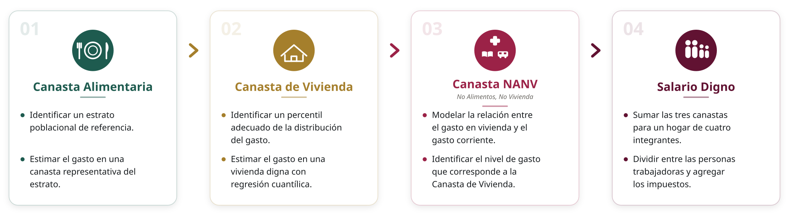{#fig-diagrama width=100%}

La principal fuente de información es la ENIGH 2024, elaborada por el INEGI. Contiene datos sobre el consumo, el gasto y la procedencia de los ingresos de 91,414 hogares, así como las características de la vivienda que habitan y el perfil sociodemográfico de sus integrantes. Su diseño es representativo a nivel nacional, por entidad federativa y por ámbito urbano y rural, lo que permite estimar un salario digno para 66 zonas de representatividad (dos nacionales, una por ámbito, y 64 por entidad y ámbito). Todas las estimaciones se realizaron respetando el diseño muestral complejo de la encuesta (estratos, unidades primarias de muestreo y factores de expansión).

La metodología de estudios subnacionales contempla ajustes normativos al gasto corriente monetario, como excluir el tabaco y bebidas azucaradas, o reasignar 50% del gasto en alimentos fuera del hogar al rubro NANV. Para limitar las decisiones de carácter normativo, estos ajustes se omiten. La omisión reduce de forma marginal la comparabilidad con estimaciones de terceros que sí los aplican (por ejemplo, las del ARI), y conserva intacta la comparabilidad entre entidades, que es la prioridad de la Comisión.

```{r}
#| label: setup-metodologia
#| echo: false
#| message: false
#| warning: false

rep_cv <- read_csv("../finaldata/metodologia/representatividad_cv.csv", show_col_types = FALSE)
hogar  <- read_csv("../finaldata/metodologia/hogar_composicion.csv", show_col_types = FALSE)

fmt2 <- function(x) format(round(x, 2), nsmall = 2)

# Composición del hogar: promedios nacionales por ámbito y extremos por entidad
val_hogar <- function(amb, var) {
  hogar |> filter(nom_ent == "Nacional", ambito == amb) |> pull({{ var }})
}
amb_low <- function(d) tolower(d$ambito)

hogar_ent <- hogar |> filter(nom_ent != "Nacional")
integ_max <- hogar_ent |> slice_max(integrantes, n = 1)
integ_min <- hogar_ent |> slice_min(integrantes, n = 1)

dep_lista <- function(d) {
  knitr::combine_words(
    sprintf("%s %s (%s)", d$nom_ent, tolower(d$ambito), fmt2(d$ratio)),
    sep = ", ", and = " y ", oxford_comma = FALSE
  )
}
dep_top <- hogar_ent |> slice_max(ratio, n = 4) |> arrange(desc(ratio))
dep_bot <- hogar_ent |> slice_min(ratio, n = 4) |> arrange(ratio)

# Representatividad: zonas con confianza distinta de alta
rep_no_alta <- rep_cv |> filter(confianza != "Alta")
```

## Representatividad estadística

Como paso preliminar, buscando identificar la confianza estadística de la encuesta [@prates2024subnational], se evaluó su precisión estadística para cada zona de representatividad. Para los rubros de gasto en alimentos, vivienda y NANV, y para el gasto corriente total, se estimaron la media y el coeficiente de variación por entidad y ámbito. El coeficiente de variación se define como

$$ cv(x) = \frac{SE(x)}{E(x)}, $$

donde $SE(x)$ es el error estándar del estimador y $E(x)$ su media. Siguiendo los criterios del INEGI, un estimador es poco confiable si su coeficiente de variación supera 0.30, tiene confianza media si se ubica entre 0.15 y 0.30, y confianza alta si es inferior a 0.15.

Bajo este criterio, las 66 zonas de representatividad resultan confiables. Solo el rubro de `r tolower(rep_no_alta$rubro)` en el ámbito `r tolower(rep_no_alta$ambito)` de `r rep_no_alta$nom_ent` alcanza un grado de confianza media, con un coeficiente de variación de `r fmt2(rep_no_alta$cv)`; el resto de las entidades y rubros presenta confianza alta, y en el ámbito urbano ninguna entidad o rubro supera 0.15 (se encuentra dentro del umbral de INEGI)[^brasil-cv]. El coeficiente de variación por entidad, ámbito y rubro se reporta en el [anexo I](#sec-anexo-i).

[^brasil-cv]: Estos resultados marcan una diferencia fundamental con la aplicación brasileña de la metodología pues su ejercicio se enfrenta a coeficientes de variación elevados (superiores a 0.20) o muestras menores a 200 observaciones. Por esta razón, en su aplicación se fusiona zonas contiguas para alcanzar niveles aceptables de error muestral [@prates2024subnational]. En el caso mexicano, bajo el umbral más estricto del INEGI (0.15), las zonas son confiables sin necesidad de fusionarlas ni de desagregarlas mediante regresión, por lo que cada combinación de entidad y ámbito se estima de forma directa.

El gasto corriente medio por entidad muestra una clara división entre el norte y el sur del país: las entidades del sur incurren, en promedio, en menos gastos que las del norte y el centro (@fig-gasto-corriente). La Ciudad de México es el caso atípico para toda la República, pues se presenta consistentemente como la entidad con el mayor gasto en los tres rubros del gasto corriente monetario, particularmente en vivienda.

```{=latex}
\begin{landscape}
```

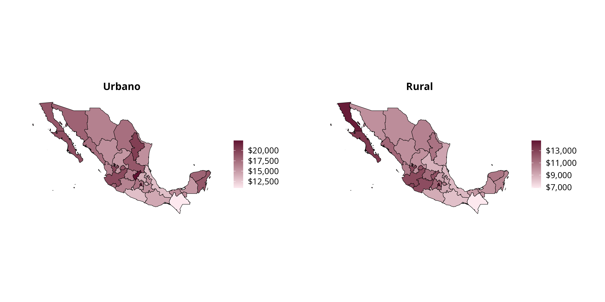{#fig-gasto-corriente width=100%}

```{=latex}
\end{landscape}
```

## Selección del tamaño y composición del hogar de referencia

La estimación de cada componente toma como referencia el tamaño y la composición de un hogar de referencia. La Dirección Técnica de la Conasami optó por criterios positivos para definirlo, reduciendo en lo posible las elecciones normativas de la Canasta Digna. El insumo principal para la definición del hogar de referencia fueron las estadísticas de composición de los hogares de la ENIGH 2024. A nivel nacional, el promedio de integrantes por hogar es de `r fmt2(val_hogar("Total", integrantes))` personas, mientras que en los ámbitos rural y urbano es de `r fmt2(val_hogar("Rural", integrantes))` y `r fmt2(val_hogar("Urbano", integrantes))`, respectivamente. El promedio de personas ocupadas por hogar es de `r fmt2(val_hogar("Total", trabajadoras))` a nivel nacional, de `r fmt2(val_hogar("Rural", trabajadoras))` en el ámbito rural y `r fmt2(val_hogar("Urbano", trabajadoras))` en el urbano. El mayor número de integrantes se observa en el ámbito `r amb_low(integ_max)` de `r integ_max$nom_ent`, con un promedio de `r fmt2(integ_max$integrantes)` personas y `r fmt2(integ_max$trabajadoras)` personas trabajadoras; el menor, en el ámbito `r amb_low(integ_min)` de `r integ_min$nom_ent`, con `r fmt2(integ_min$integrantes)` integrantes y `r fmt2(integ_min$trabajadoras)` personas trabajadoras (@fig-composicion).

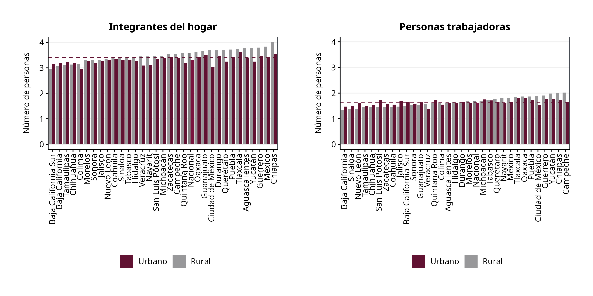{#fig-composicion}

La razón de dependencia, medida como el número de integrantes, sin importar su edad ni género, que corresponde a cada persona trabajadora en un hogar promedio, es de `r fmt2(val_hogar("Total", ratio))` a nivel nacional, de `r fmt2(val_hogar("Rural", ratio))` en el ámbito rural y `r fmt2(val_hogar("Urbano", ratio))` en el urbano. Las entidades con la razón más alta son `r dep_lista(dep_top)`; las más bajas corresponden a `r dep_lista(dep_bot)` (@fig-ratio).

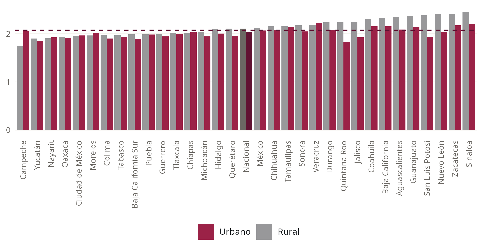{#fig-ratio}

Considerando que las diferencias entre estados son mínimas, como se observa en la @fig-composicion y la @fig-ratio, y para favorecer la comparabilidad, se adoptó como referencia el número entero siguiente al promedio nacional de integrantes y de personas trabajadoras. El hogar de referencia se compone, así, de cuatro integrantes, con dos personas trabajadoras y dos dependientes económicos.

## Componentes de la Canasta Digna

La Canasta Digna es la suma de tres canastas que representan el gasto en alimentos, vivienda y NANV. Los detalles metodológicos de cada una se presentan en la sección de Resultados; este apartado describe a grandes rasgos su estimación.

**Alimentos.** La Canasta alimentaria es el gasto en un conjunto de bienes y cantidades que representan los patrones de consumo de un estrato poblacional de referencia. La identificación de ese estrato se hace adaptando el método de carencias críticas de la CEPAL [@cepal2018pobreza; @cepal2021canastas], que selecciona como población de referencia a los hogares sin privaciones en las dimensiones de vivienda, servicios básicos, educación y alimentación, y elige el primer quintil móvil de la distribución del ingreso que satisface un umbral determinado. La Canasta Digna, por su parte, construye Indicadores de Bienestar en clave positiva (la ausencia de cada carencia) y fija el umbral en razón de esto. La selección de productos y cantidades sigue también a la CEPAL: se incorporan los bienes adquiridos por un porcentaje mínimo de los hogares de referencia (alrededor de 60 productos). Estos productos y cantidades se valoran con precios medianos implícitos (gasto entre cantidad), estimados para la muestra completa para la combinación de entidad y ámbito.

A diferencia de la CEPAL, que ajusta su canasta para que cumpla los requerimientos calóricos de la FAO, la OMS y la UNU y las metas de macronutrientes, la Canasta Digna conserva el enfoque positivo y no impone un ajuste calórico normativo. En su lugar aplica un factor de 1.20 (5% por desperdicio y condimentos, y 15% por variedad de alimentos) acorde con la metodología de Anker [@anker2017livingwages], y verifica la suficiencia de forma ex post comparando el valor estimado con la LPEI del INEGI.

**Vivienda.** La Canasta de vivienda es el gasto en una vivienda que cumple los criterios de adecuación de ONU-Hábitat (tenencia, disponibilidad de servicios, habitabilidad y asequibilidad) [@onuhabitat2018vivienda; @coneval2018vivienda]. Se identifica un percentil de la distribución del gasto en vivienda que incluye alquiler (el monto efectuado por la renta de esa vivienda o el monto que pagarían las personas por una vivienda en las mismas condiciones que la propia), servicios de agua y electricidad, además del pago del impuesto predial. Posteriormente, mediante una regresión cuantílica, se estima el nivel de gasto correspondiente a dicho percentil para las viviendas que satisfacen los criterios de adecuación señalados.

**NANV.** La Canasta NANV se estima a partir de su relación con el gasto en vivienda digna, bajo el supuesto de que un hogar que destina un monto acorde con los estándares de adecuación en vivienda realiza también un gasto apropiado en los demás rubros no alimentarios. Para cada zona de representatividad se modela la relación entre el gasto en vivienda y la distribución del gasto corriente monetario mediante un modelo monotónico (una curva de Engel del gasto en vivienda), y sus predicciones permiten ubicar el valor de la Canasta NANV que corresponde al de la Canasta de vivienda. Este enfoque deriva el gasto no alimentario a partir de la vivienda, una mejor alternativa que el gasto alimentario y en lugar del coeficiente de Orshansky que la CEPAL aplica como cociente fijo respecto al gasto alimentario [@cepal2021canastas].

# Resultados

## Canasta de Alimentos

```{r}
#| label: setup-alimentos
#| echo: false
#| message: false
#| warning: false

pacman::p_load(dplyr, readr, tidyr, knitr)

cifras    <- read_csv("../finaldata/alimentos/8.cifras_texto.csv",       show_col_types = FALSE)
canasta_a <- read_csv("../finaldata/alimentos/7.canasta_alimentaria.csv", show_col_types = FALSE)
indice_b  <- read_csv("../finaldata/alimentos/3.tabla_indice_bienestar.csv", show_col_types = FALSE)
pct_ind   <- read_csv("../finaldata/alimentos/2.percentiles_indicadores_bienestar.csv", show_col_types = FALSE)
lpei_a    <- read_csv("../finaldata/alimentos/9.comparacion_lpei.csv",   show_col_types = FALSE)
comp_cif  <- read_csv("../finaldata/alimentos/11.cifras_comparacion.csv", show_col_types = FALSE)

cif  <- function(c) cifras |> filter(concepto == c) |> pull(valor)
fmt1 <- function(x) format(round(x, 1), nsmall = 1)
coma <- function(x) format(x, big.mark = ",", scientific = FALSE)

# Número grande en formato parcial de letra del Manual DT 2026: "25 millones 16 mil 164".
millones <- function(x) {
  x <- round(x)
  mill  <- x %/% 1e6
  resto <- x %% 1e6
  miles <- resto %/% 1e3
  unid  <- resto %% 1e3
  partes <- character(0)
  if (mill  > 0) partes <- c(partes, paste0(coma(mill), if (mill == 1) " millón" else " millones"))
  if (miles > 0) partes <- c(partes, paste0(coma(miles), " mil"))
  if (unid  > 0 || length(partes) == 0) partes <- c(partes, coma(unid))
  paste(partes, collapse = " ")
}

# Cifras de comparación de indicadores: dimensión x fuente {CONASAMI|INEGI} x métrica.
cmp <- function(dim, fnt, met) {
  comp_cif |> filter(dimension == dim, fuente == fnt, metrica == met) |> pull(valor)
}
# Brecha en puntos porcentuales (INEGI menos CONASAMI) de una métrica.
brecha <- function(dim, met) cmp(dim, "INEGI", met) - cmp(dim, "CONASAMI", met)

# Canasta: extremos por entidad y valores nacionales por ámbito.
ca_ent     <- canasta_a |> filter(nom_ent != "Nacional")
ca_min     <- ca_ent |> slice_min(canasta_alimentos, n = 1)
ca_max     <- ca_ent |> slice_max(canasta_alimentos, n = 1)
ca_nac_rur <- canasta_a |> filter(nom_ent == "Nacional", ambito == "Rural")  |> pull(canasta_alimentos)
ca_nac_urb <- canasta_a |> filter(nom_ent == "Nacional", ambito == "Urbano") |> pull(canasta_alimentos)

# Habitabilidad y saneamiento: incidencia en los extremos de la distribución.
mat_p1   <- pct_ind |> filter(percentil_nacional == 1)   |> pull(`i.materiales.p`)  * 100
mat_p100 <- pct_ind |> filter(percentil_nacional == 100) |> pull(`i.materiales.p`)  * 100
san_p1   <- pct_ind |> filter(percentil_nacional == 1)   |> pull(`i.saneamiento.p`) * 100

# Criterio de intersección en el primer decil por ámbito.
int_urb1 <- indice_b |> filter(percentil == 1, rural == 0) |> pull(criterio_interseccion)
int_rur1 <- indice_b |> filter(percentil == 1, rural == 1) |> pull(criterio_interseccion)

# LPEI (Coneval, agosto 2024).
lpei_rur <- lpei_a |> filter(ambito == "Rural")  |> pull(lpei)
lpei_urb <- lpei_a |> filter(ambito == "Urbano") |> pull(lpei)
```

### Introducción

La Canasta Alimentaria se define como el gasto en alimentos que representan los patrones de consumo de un estrato poblacional de referencia[^6]. El monto de la Canasta varía por entidad y ámbito (rural o urbano), y tiene el propósito de ser un umbral con el cual identificar a la población con privaciones alimentarias en México. La construcción de la Canasta se realizó con los siguientes pasos: 1) se identificó al estrato poblacional de referencia; 2) se seleccionaron los productos y las cantidades representativas del consumo del estrato; 3) se calculó el precio mediano de cada producto por entidad y ámbito; 4) se obtuvo el valor monetario del consumo a nivel nacional, entidad y ámbito.

[^6]: La canasta no representa una recomendación para la alimentación de las personas; se expresa en valor monetario enfatizando que, por adquirirse a través del mercado, las personas pueden decidir sobre su propia alimentación.

El estrato poblacional se utiliza para identificar los patrones de consumo de una población que, se considera, alcanza un nivel de vida digno; su selección se realizó a nivel nacional y ámbito, adaptando la metodología de indicadores de carencia propuesta por CEPAL. Con base en ello, se construyeron Indicadores de Bienestar para identificar a los hogares con condiciones adecuadas en las dimensiones de vivienda, alimentación, servicios básicos y educación (@tbl-indicadores-def). Las cuatro dimensiones están conceptualmente relacionadas con la perspectiva de una vida digna; por ejemplo, vivienda y servicios básicos se basan en la idea de habitar una vivienda que proteja del ambiente y sea adecuada para prevenir enfermedades infecciosas. En tanto que alimentación y educación son condiciones necesarias para el libre desarrollo de la personalidad y para el disfrute de una vida digna.

La identificación del estrato de referencia es el paso que determina qué patrones de consumo se incorporan a la Canasta; una selección inadecuada trasladaría hábitos de hogares con privaciones alimentarias severas o, en el extremo opuesto, de hogares con capacidades de compra que exceden el umbral de una vida digna. En la literatura se distinguen dos enfoques clásicos. El primero selecciona al grupo cuya ingesta calórica aparente se aproxima al requerimiento energético promedio de la población, usando la suficiencia calórica como indicador indirecto del nivel de vida. El segundo, de naturaleza iterativa [@cepal2018pobreza], identifica al grupo cuyo gasto promedio coincide con la línea de pobreza resultante del proceso.

Ambos enfoques presentan dificultades que han motivado la búsqueda de alternativas. La medición de la ingesta calórica a partir de las encuestas de ingresos y gastos es imprecisa pues el nivel estimado puede quedar subestimado o sobrestimado según el período de levantamiento y la captación del gasto en alimentos [@cepal2018pobreza]. Además, el vínculo entre ingesta calórica insuficiente y pobreza se ha debilitado en las últimas décadas conforme la obesidad se ha extendido a los estratos de menores ingresos, lo que ha reducido la capacidad del indicador para discriminar entre hogares con y sin restricciones económicas. El método iterativo, por su parte, carece de un criterio exógeno de suficiencia: la línea de pobreza depende del grupo de referencia y el grupo depende de la línea, de modo que el proceso verifica consistencia interna pero no garantiza que las condiciones de vida del estrato elegido sean efectivamente adecuadas [@cepal2018pobreza].

La actualización metodológica de @cepal2018pobreza combina las virtudes de ambos enfoques mediante el método de carencias críticas. La suficiencia se evalúa con base en cuatro dimensiones materiales de vida (vivienda, servicios básicos, alimentación y educación), sin depender exclusivamente de la ingesta calórica. Para mayor precisión en la localización del umbral, los hogares se ordenan por ingreso corriente per cápita y se agrupan en quintiles móviles, es decir, intervalos del 20% de los hogares que se desplazan centil a centil. A diferencia de los quintiles convencionales fijos, este diseño permite identificar el límite inferior del estrato suficiente con mayor resolución, manteniendo un tamaño de muestra que garantice representatividad estadística. Además, su metodología incorpora el proceso iterativo de forma que, si el gasto promedio del estrato seleccionado resulta inferior a la línea de pobreza derivada de ese mismo proceso, la referencia se desplaza un centil hacia arriba en la distribución hasta que ambas condiciones se satisfagan de forma simultánea.

Para la selección del quintil móvil de referencia @cepal2018pobreza hace uso de tres criterios. El criterio de unión (basta una sola carencia para excluir del grupo) implica errores de inclusión elevados: dada la imprecisión propia de indicadores como la fuente de agua o la ingesta calórica estimada a partir del gasto semanal, muchos hogares que satisfacen sus necesidades básicas quedarían clasificados erróneamente como privados. El criterio de intersección (privación en las cuatro dimensiones) minimiza ese riesgo, pero eleva el error de exclusión, pues descarta hogares que satisfacen tres de cuatro dimensiones y cuyos hábitos de consumo son, en lo sustantivo, representativos de un nivel de vida adecuado. El criterio intermedio, con el umbral en dos o más carencias simultáneas, equilibra ambos errores: la exigencia de coincidencia en al menos dos dimensiones atenúa el efecto de errores de medición en una sola variable y mantiene un patrón claramente decreciente conforme aumenta el ingreso, lo que garantiza la capacidad discriminante del criterio a lo largo de la distribución [@cepal2018pobreza]. Los criterios adoptados en esta estimación son similares, aunque la lógica se invierte por el sentido positivo de los Indicadores de Bienestar.

En el diseño de @cepal2018pobreza, la población de referencia se selecciona a nivel nacional y posteriormente se divide por área geográfica aplicando un deflactor de precios que corrige las diferencias de poder adquisitivo entre el ámbito urbano y el rural. En la Canasta Digna ese deflactor es innecesario porque el estrato de referencia se identifica de forma independiente para cada ámbito. Los patrones de consumo urbanos y rurales se tratan como estructuras distintas desde el inicio, lo que permite mayor fidelidad a las preferencias y precios observados en cada contexto. La segunda adaptación consiste en invertir la dirección de los indicadores. La metodología original identifica hogares con carencias, mientras que la Canasta Digna construye Indicadores de Bienestar (condiciones cuya presencia señala suficiencia). Por esto, es necesario invertir la regla de selección, de forma que, en lugar del primer quintil con 10% o menos de hogares con dos o más carencias, se identifica el primer quintil con 90% o más de hogares que cumplen al menos dos Indicadores de Bienestar. El umbral de referencia queda así anclado de manera afirmativa en un estándar de suficiencia, orientado a caracterizar positivamente las condiciones de una vida digna.

### Indicadores de Bienestar

La @tbl-indicadores-def muestra los Indicadores de Bienestar seleccionados junto con su definición para cada una de las cuatro dimensiones analizadas. Para cada dimensión se construyeron varios Indicadores alternativos y se conservó el que mejor distingue las condiciones de vida del hogar conforme aumenta el ingreso, en línea con la lógica de identificar un grupo de referencia cuyas condiciones materiales de vida sean adecuadas [@anker2017livingwages]. Se identificó el percentil de la distribución del ingreso corriente per cápita al que pertenece cada hogar, ordenándolos de menor a mayor, y se calculó la proporción de hogares que cumplen cada Indicador en cada percentil. Al contrastar el ingreso con esa proporción, se seleccionaron los indicadores con una clara relación positiva con el ingreso corriente, es decir, aquellos con incidencias bajas en la cola izquierda y altas en la cola derecha de la distribución, por ser los que mejor discriminan a los hogares con condiciones de bienestar suficientes [@cepal2018pobreza]. Se descartaron los indicadores cuya incidencia resultó casi plana o poco creciente a lo largo de la distribución: en alimentación, el de exceso de gasto en alimentos (hogares que destinan 75% o más de su gasto monetario a alimentos); en vivienda, la ausencia de hacinamiento; y en servicios básicos, el acceso a fuentes de agua, que en México alcanza coberturas altas en casi todos los niveles de ingreso y por ello discrimina poco entre hogares.

| Dimensión | Indicador seleccionado | Definición |
|------------------|------------------------------------|------------------|
| Vivienda | Materiales adecuados (habitabilidad) | Paredes, techos y pisos de materiales resistentes y sin daños estructurales (grietas, humedad, pandeos o levantamientos). |
| Servicios básicos | Servicios de baño | Excusado de uso no compartido, con conexión de agua y drenaje a la red pública. |
| Alimentación | Sin falta de alimentos | El hogar no se quedó sin alimentos por falta de recursos en los últimos tres meses. |
| Educación | Asistencia escolar | Todas las personas de 3 a 18 años asisten a la escuela, e infancias menores de 3 años con acceso a educación inicial. |

: Indicadores de Bienestar seleccionados por dimensión. Dimensiones y definición del concepto. {#tbl-indicadores-def}

La @fig-indicadores muestra el comportamiento de los indicadores construidos; los seleccionados se presentan en guinda. Para la dimensión de bienestar en vivienda se optó por el indicador de "materiales adecuados", que incorpora las recomendaciones de ONU-Hábitat para la identificación de viviendas adecuadas (descritas en el siguiente apartado). Con este indicador se identificaron `r millones(cif("con_materiales"))` hogares que habitan una vivienda con materiales adecuados y `r millones(cif("sin_materiales"))` que no. Un mayor ingreso se relaciona directamente con la condición de habitabilidad de la vivienda: entre los hogares de menores ingresos, alrededor de `r fmt1(mat_p1)`% habita una vivienda que cumple los estándares de habitabilidad, mientras que entre los de mayores ingresos la proporción alcanza `r fmt1(mat_p100)`%[^7].

[^7]: El criterio de habitabilidad incluye variables que identifican daños estructurales presentes en la vivienda, como grietas o humedad en techos, paredes o pisos. Por esa razón, incluso el percentil de mayores ingresos no cumple al 100% el indicador.

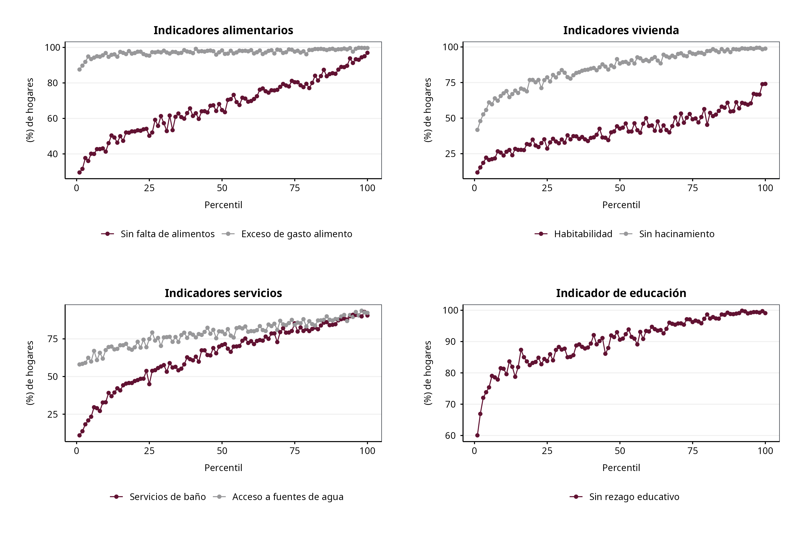{#fig-indicadores}

Para la dimensión de Servicios Básicos se seleccionó el indicador de "Servicios de baño": se identificaron `r millones(cif("con_saneamiento"))` hogares con acceso a servicios adecuados de baño y `r millones(cif("sin_saneamiento"))` que no. Estos últimos se concentran en las colas bajas de la distribución; solo `r fmt1(san_p1)`% de los hogares de menores ingresos cuenta con acceso a un baño adecuado. En alimentación se seleccionó el indicador de "Sin falta de alimentos", que identificó `r millones(cif("con_alim"))` hogares que reportaron no haberse quedado sin alimentos por falta de recursos y `r millones(cif("sin_alim"))` que sí. Por último, el indicador de educación identificó `r millones(cif("sin_edu"))` hogares con alguna infancia que no asiste a la educación básica y `r millones(cif("con_edu"))` hogares en los que todas las personas menores de edad asisten a la escuela, o que no cuentan con alguna persona menor de edad.

### Comparación con los indicadores de pobreza multidimensional

El objetivo de los Indicadores de Bienestar es identificar condiciones de vida adecuadas, y por esto requieren una exigencia más alta que la sola ausencia de carencias. Para dimensionar esa diferencia se contrastan con los indicadores de carencia de la medición multidimensional de la pobreza del INEGI [@coneval2010multidimensional], que comparten las dimensiones de alimentación, vivienda, servicios básicos y educación. Para facilitar la comparación, los indicadores de pobreza multidimensional se expresan en forma positiva (se identifica la ausencia del indicador de pobreza), y para cada uno se calcula el porcentaje de hogares que lo cumple a lo largo de los percentiles del ingreso corriente per cápita (@fig-comparacion-pobreza).

En las tres dimensiones de condiciones materiales de vida (alimentación, vivienda y servicios básicos), el Indicador de Bienestar de la Canasta Digna resulta más restrictivo, pues para cada percentil del ingreso, una proporción menor de hogares satisface el criterio de Conasami que el de INEGI. La brecha es más amplia en vivienda, donde `r fmt1(cmp("Vivienda (calidad)", "CONASAMI", "pct_nacional"))`% de los hogares cumple el estándar de habitabilidad de Conasami frente a `r fmt1(cmp("Vivienda (calidad)", "INEGI", "pct_nacional"))`% que no presenta carencia por calidad y espacios de la vivienda, una diferencia de `r fmt1(brecha("Vivienda (calidad)", "pct_nacional"))` puntos porcentuales. La mayor exigencia proviene de los criterios adicionales. Por ejemplo, el indicador para vivienda descarta las viviendas con daños estructurales (grietas, humedad, pandeos o levantamientos). En alimentación, `r fmt1(cmp("Alimentación", "CONASAMI", "pct_nacional"))`% de los hogares cumple el criterio de Conasami contra `r fmt1(cmp("Alimentación", "INEGI", "pct_nacional"))`% sin carencia alimentaria, y en servicios básicos `r fmt1(cmp("Servicios básicos", "CONASAMI", "pct_nacional"))`% contra `r fmt1(cmp("Servicios básicos", "INEGI", "pct_nacional"))`%.

El Indicador de Educación sigue un patrón distinto: `r fmt1(cmp("Educación", "CONASAMI", "pct_nacional"))`% de los hogares cumple el criterio de asistencia escolar de Conasami, por encima de `r fmt1(cmp("Educación", "INEGI", "pct_nacional"))`% sin rezago educativo del Coneval. La diferencia obedece a que cada indicador mide un concepto distinto. El rezago educativo del INEGI evalúa a todas las personas del hogar respecto a la escolaridad obligatoria de su generación, de modo que un solo integrante adulto con escolaridad incompleta basta para clasificar al hogar con carencia. El Indicador de Conasami se concentra en la asistencia escolar corriente de las personas de 3 a 18 años, una condición que se satisface en mayor medida que el indicador de rezago educativo. Ambos indicadores son válidos para sus propios fines y no resultan comparables en términos de restrictividad.

La mayor exigencia de los Indicadores de Bienestar es coherente con la lógica del salario digno. El estrato de referencia debe reflejar los patrones de consumo de hogares con un nivel de vida digno y la ausencia de pobreza constituye un piso inferior a ese estándar [@anker2017livingwages]. Los umbrales de la medición multidimensional identifican un mínimo de derechos sociales, mientras que los Indicadores de Bienestar buscan caracterizar la suficiencia, un estándar afirmativo de condiciones adecuadas [@cepal2018pobreza]. Definir el estrato con criterios más estrictos asegura que las cantidades y los patrones de consumo que alimentan la Canasta provengan de hogares cuyas condiciones de vida son efectivamente dignas.

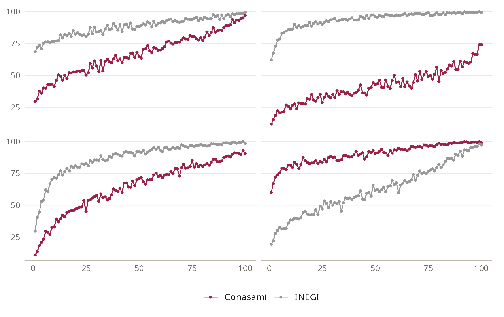{#fig-comparacion-pobreza}

### Selección del estrato de referencia

Se calcularon tres criterios para la selección del estrato poblacional de referencia: el **criterio de unión**, que identifica el porcentaje de hogares que cumplen con al menos un Indicador de Bienestar; el **criterio de intersección**, para el porcentaje de hogares que cubren los cuatro Indicadores; y el **criterio intermedio**, para el porcentaje de hogares con al menos dos Indicadores. El comportamiento de los criterios por decil de la distribución del ingreso se muestra en el @tbl-indice-bienestar. El criterio de intersección tiene un comportamiento claramente ascendente: entre más ingreso tienen los hogares, más probable es que cumplan con los cuatro Indicadores de Bienestar. Los criterios de unión e intermedio muestran promedios elevados, pues es común observar hogares con al menos uno o dos indicadores. Los criterios del ámbito rural son marcadamente menores; por ejemplo, con el criterio de intersección, `r fmt2(int_urb1)`% de los hogares de menores ingresos (primer decil) en ámbito urbano tiene sus necesidades básicas satisfechas, frente a `r fmt2(int_rur1)`% en el ámbito rural.

Como regla de selección se usó el criterio intermedio, ya que incluir más indicadores reduce la imprecisión derivada de los posibles errores en la medición e interpretación de las variables de la ENIGH[^8]. Se eligió como estrato de referencia el primer quintil móvil de la distribución del ingreso corriente para el cual el porcentaje de hogares que cumplen al menos dos Indicadores de Bienestar es igual o mayor a 90%.

[^8]: Véase @cepal2018pobreza para la derivación formal del criterio intermedio y los resultados de su aplicación en 18 países de América Latina.

```{r}
#| label: tbl-indice-bienestar
#| echo: false
#| tbl-cap: "Criterios para el Estrato de Referencia por decil del ingreso y ámbito (porcentaje de hogares)."

indice_b |>
  mutate(`Ámbito` = if_else(rural == 1, "Rural", "Urbano")) |>
  transmute(Decil = percentil, `Ámbito`,
            `Unión` = criterio_union,
            Intermedio = criterio_intermedio,
            `Intersección` = criterio_interseccion) |>
  arrange(`Ámbito`, Decil) |>
  kable(digits = 2, align = "c")
```

Los estratos seleccionados fueron el quinto y sexto decil para el ámbito urbano, y el noveno y décimo para el rural. En el ámbito urbano, el primer decil que cumple la regla de selección es el quinto; en el rural ninguno la cumple, por lo que se usaron los dos últimos. Esto representa una muestra de `r coma(cif("n_muestra_total"))` hogares, `r coma(cif("n_muestra_urbano"))` en ámbito urbano y `r coma(cif("n_muestra_rural"))` en rural, representativos de `r millones(cif("n_pob_urbano"))` y `r millones(cif("n_pob_rural"))` hogares, respectivamente. Con el objetivo de obtener Canastas alimentarias con aproximadamente 60 productos, se identificaron los bienes más consumidos por al menos 10% de los hogares en el ámbito urbano y 8% en el rural, lo que representó `r cif("n_productos_urbano")` productos para urbano y `r cif("n_productos_rural")` para rural. La selección de las cantidades de referencia por producto se hizo a nivel nacional y de ámbito (para facilitar la comparabilidad de las estimaciones entre entidades), tomando el consumo mediano de cada producto. El precio de cada producto se estima con la siguiente fórmula:

$$\text{Precio}_{ijk} = \frac{\text{Gasto total en el alimento}_{ijk}}{\text{Cantidad total consumida}_{ijk}}$$

donde $i$ es un producto contenido en la Canasta urbana o rural, $j$ es la entidad y $k$ es el ámbito. El valor unitario (gasto entre cantidad) se calcula para cada hogar que reporta el consumo del producto en la entidad y el ámbito, sin restringir el cálculo al estrato de referencia. Antes de estimarlo se recortan los valores atípicos dentro de cada producto, entidad y ámbito mediante el criterio del rango intercuartílico (se descartan las observaciones que se ubican fuera de 1.5 veces el rango intercuartílico respecto al primer y al tercer cuartil), y el precio final es la mediana ponderada de los valores restantes.

Estimar el precio sobre el conjunto de hogares de cada entidad y ámbito, y no solo sobre el estrato de referencia tiene el objetivo de propiciar que los precios implícitos reflejen el valor efectivamente observado por los hogares en la entidad en el mercado. Las cantidades de referencia describen el patrón de consumo de un nivel de vida digno y por ello provienen del estrato; el precio, en cambio, es una condición del mercado que enfrentan por igual los hogares de la entidad. Adicionalmente, calcularlo sobre todos los hogares amplía el número de observaciones por producto, otorga estimaciones más estables a nivel desagregado por entidad y ámbito, y evita que las decisiones de compra del estrato sesguen el valor unitario. El criterio es congruente con la metodología de Anker, que valora una dieta de referencia a los precios de mercado vigentes en la localidad, estimados con independencia del grupo que define la dieta [@anker2017livingwages]. Usar el precio mediano (gasto entre cantidad) se elige por su menor sensibilidad a los valores extremos, y sigue a CEPAL [@cepal2023cbs]; la diferencia es que aquí se calcula sobre toda la entidad y no sobre el estrato de referencia.

Con los productos y las cantidades de referencia, junto con el precio de cada producto a nivel nacional, entidad y ámbito, se obtiene el valor del consumo como el producto entre la cantidad de referencia y el precio calculado. Como último paso, el valor de la Canasta Alimentaria es la suma del valor de cada producto más un 5% por condimentos y desperdicio y un 15% adicional por variedad de alimentos, acorde a la metodología de Salario Digno del Instituto Anker.

### Resultados

El valor mínimo estimado de la Canasta alimentaria (para los valores completos véase el [anexo V](#sec-anexo-v)) se ubicó en el ámbito `r tolower(ca_min$ambito)` de `r ca_min$nom_ent`, con `r fmt(ca_min$canasta_alimentos)` pesos mensuales por persona; el valor más alto fue en `r ca_max$nom_ent` `r tolower(ca_max$ambito)`, con `r fmt(ca_max$canasta_alimentos)` pesos mensuales. Esta brecha refleja la disparidad de precios entre el norte y el sur del país, y entre ámbitos. El valor nacional fue de `r fmt(ca_nac_rur)` pesos mensuales en el ámbito rural y `r fmt(ca_nac_urb)` en el urbano. La @fig-mapa-alimentos presenta el valor estimado por entidad y ámbito.

```{=latex}
\begin{landscape}
```

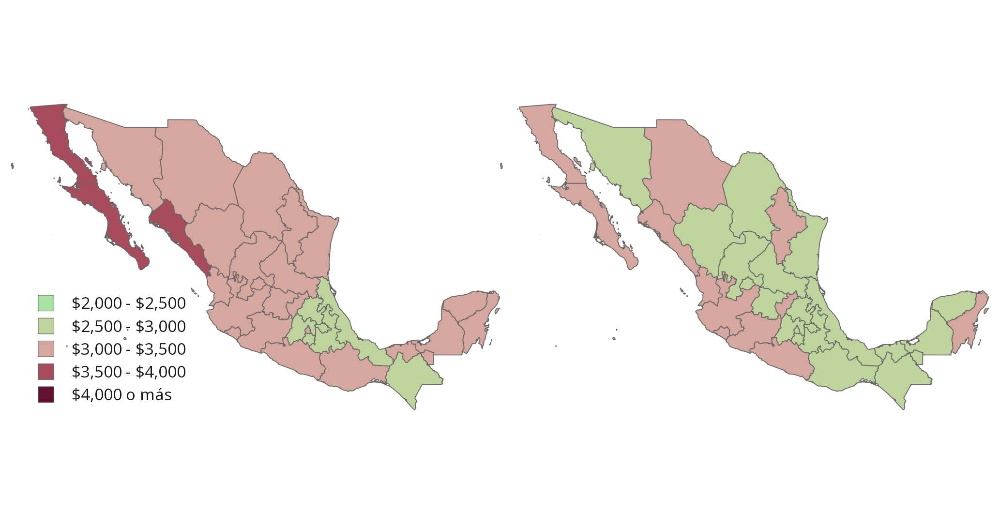{#fig-mapa-alimentos width=100%}

```{=latex}
\end{landscape}
```

Como referencia, la LPEI de Coneval para agosto de 2024, mes del levantamiento de la encuesta, fue de `r fmt(lpei_rur)` pesos mensuales en el ámbito rural y `r fmt(lpei_urb)` en el urbano. La cercanía entre las estimaciones de la Canasta Alimentaria y la LPEI respalda la validez de los resultados[^9] y confirma que el monto es suficiente para cumplir los estándares nacionales e internacionales de ingesta calórica. La @fig-canasta-lpei contrasta el valor de la Canasta de cada entidad y ámbito con la LPEI correspondiente.

[^9]: En particular, los requerimientos nutricionales referenciados por Coneval. Véase: Bourges, H., Casanueva, E. y Rosado, J. L. (2008). *Recomendaciones de ingestión de nutrimentos para la población mexicana. Bases fisiológicas*, Tomo I. México: Editorial Médica Panamericana; Norma Oficial Mexicana NOM-043-SSA2-2012, *Servicios Básicos de Salud. Promoción y educación para la salud en materia alimentaria*, Diario Oficial de la Federación, 22 de enero de 2013; CEPAL (2007). *Principios y aplicación de las nuevas necesidades de energía según el Comité de expertos FAO/OMS 2004*. Estudios estadísticos y prospectivos, 56, Santiago de Chile.

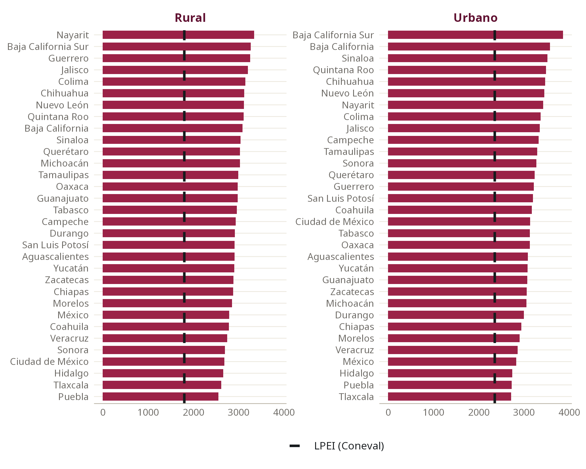{#fig-canasta-lpei}

## Canasta de Vivienda

### Introducción

El segundo componente de la Canasta Digna es la Canasta de Vivienda. Para su definición se adopta el concepto de vivienda y hogar establecido por la ONU [@un2017censuses], en concordancia con los criterios estadísticos utilizados por el INEGI. Su construcción se alinea con los estándares de ONU-Hábitat y del programa Hábitat III, del que México es parte desde 1996. En particular, se retoman los principios de la NAU, adoptada en 2016, que establece que los asentamientos humanos deben desarrollarse de manera consistente con los ODS de cara a 2030 [@onuhabitat2018vivienda]. Al igual que en la Canasta Alimentaria, se trabajó con la ENIGH 2024, la última versión disponible, siguiendo la metodología de estimaciones Subnacionales de Salario Digno de Anker [@prates2024subnational; @anker2017livingwages].

Bajo esta línea argumentativa se tiene que, para fines de este documento, la vivienda se define como:

> *[...] un cuarto o conjunto de cuartos con sus dependencias, ubicados en un edificio permanente o en una parte del mismo estructuralmente separada, que --por su forma de construcción, reconstrucción o adaptación-- está destinada a ser habitada por un hogar y que, al momento del censo, no se utiliza completamente para otros fines. Debe contar con acceso independiente a una calle (directo o a través de un jardín o terreno) o a un espacio común dentro del edificio (escalera, pasillo, galería, etc.).*
>
> *Por lo tanto, una vivienda convencional debe cumplir cuatro características esenciales:*
>
> a)  *Ser un cuarto o conjunto de cuartos;*
> b)  *Estar ubicada en un edificio permanente;*
> c)  *Tener acceso separado a una calle o a un espacio común;*
> d)  *haber sido diseñada para ser ocupada por un solo hogar* [@un2017censuses]*.*

Del mismo modo, un hogar se define como:

> *[...] los acuerdos que realizan las personas, individualmente o en grupo, para abastecerse de alimentos y otros artículos esenciales para la vida. Un hogar puede ser (a) unipersonal, es decir, una persona que se abastece de alimentos y otros artículos esenciales para la vida sin unirse con ninguna otra persona para formar un hogar multipersonal; o (b) multipersonal, es decir, un grupo de dos o más personas que viven juntas y se abastecen en común de alimentos y otros artículos esenciales para la vida. Las personas del grupo pueden compartir sus recursos y tener un presupuesto común; y pueden ser personas emparentadas o no emparentadas, o constituir una combinación de personas emparentadas y no emparentadas* [@un2017censuses]*.*

Estas definiciones también son retomadas por el INEGI en el diseño conceptual de la ENIGH (INEGI, 2023), lo que nos permite operar la encuesta para la realización de indicadores sobre las características de las viviendas y, además, poder medir variables de ingresos y gastos a nivel hogar, unidad de observación del presente estudio.

En este sentido, ONU-Hábitat es un programa de la ONU cuyo mandato es promover ciudades y asentamientos humanos más sostenibles, desde un enfoque holístico centrado en las personas y los derechos humanos [@onuhabitat2018vivienda]. Propone siete elementos para medir una vivienda adecuada^[Los siete elementos son: 1) seguridad de la tenencia; 2) disponibilidad de servicios, materiales, instalaciones e infraestructura; 3) asequibilidad; 4) habitabilidad; 5) accesibilidad; 6) ubicación, y 7) adecuación cultural.]; sin embargo, dada la información disponible en la encuesta no es posible identificar todos los elementos o dimensiones, así que para los fines de esta investigación se tomaron los primeros cuatro grandes rubros, que pueden identificarse con la ENIGH:

1. Seguridad en la **tenencia**: se refiere a que haya condiciones que garanticen a las personas protección jurídica contra el desalojo forzoso, hostigamiento y otro tipo de amenazas.
2. **Disponibilidad** de servicios, materiales, instalaciones e infraestructura: en este elemento se contemplan los diferentes servicios, materiales, instalaciones e infraestructura que debe tener una vivienda para considerarse digna, tal es el caso de la provisión de agua, instalaciones sanitarias adecuadas, energía para la cocción, calefacción y alumbrado, así como para la conservación de alimentos y eliminación de residuos.
3. **Asequibilidad**: se refiere a que el costo de la vivienda debe ser tal que todas las personas que así lo deseen puedan acceder a ella sin poner en peligro el goce de otras necesidades básicas o el ejercicio de sus derechos humanos. En este elemento la ONU establece que una vivienda se considera asequible cuando un hogar destina menos del 30% de sus ingresos en gastos asociados a la vivienda.
4. **Habitabilidad**: se refiere a contar con las condiciones que garantizan la seguridad física de las personas que habitan la vivienda y les proporcionan un espacio habitable suficiente, así como protección contra el frío, la humedad, el calor, la lluvia, el viento u otros riesgos para la salud y peligros estructurales. Aquí, la ONU también establece que no debe haber hacinamiento, es decir, que debe cumplirse la condición de que el número de personas por cuarto dormitorio no supere los 2.5, lo que garantiza espacios suficientes.

Si bien México es un país megadiverso geográficamente, con áreas con características específicas, se pretende que las Viviendas Dignas^[El parámetro internacional para el derecho a la vivienda fue establecido por la Observación General Nº 4 (1991) del CDESC de la ONU, la cual define el concepto de "vivienda adecuada" y facilita la comparabilidad internacional. México, al adherirse a los convenios del programa Hábitat, asumió el compromiso de implementar estos estándares. Si bien el artículo 4º de la CPEUM establece el derecho a una "vivienda digna y decorosa", ni esta norma ni la Ley de Vivienda especifican sus características mínimas; por ello, tal como lo explicita el Coneval en su Metodología para la medición multidimensional de la pobreza, el concepto constitucional de "vivienda digna" se ha adecuado operativamente al de "vivienda adecuada" de la ONU. Instituciones como la Conavi y el Infonavit han colaborado con ONU-Hábitat en la construcción de los indicadores nacionales que materializan este derecho.] de los hogares cumplan con lo establecido por la ONU, al ser criterios aceptados internacionalmente; lo que también permitirá hacer comparaciones entre países. Como la naturaleza de este ejercicio es dividir las estimaciones por entidad federativa y ámbito, se hicieron algunas diferenciaciones que se explicarán con mayor precisión en el apartado siguiente.

Finalmente, se estableció que el gasto en vivienda digna debe incluir el pago de servicios, agua y luz, el pago del impuesto predial y el pago de un alquiler o renta, entendiendo alquiler o renta como el pago efectuado a una persona para utilizar una vivienda como propia.

Es importante mencionar que todas estas definiciones serán aplicadas a las variables que se pueden obtener de la ENIGH 2024 a nivel hogar, nacional, por entidad federativa y además se hará la distinción entre el ámbito rural y el ámbito urbano.

### Datos

En la ENIGH 2024, se identificaron las variables necesarias para la construcción de los indicadores de vivienda digna de la siguiente forma (@tbl-vivienda-enigh).

| Indicador ONU-Hábitat | Elemento de Vivienda Digna | Variable ENIGH 2024 |
|------------------|--------------------------------|------------------|
| Tenencia | Viviendas rentadas, propias que se estuvieran pagando, y propias. | Tipo de tenencia de la vivienda |
| Tenencia | Viviendas propias que además contaran con escrituras. | Escrituras de la vivienda |
| Disponibilidad | Cuarto de cocina: viviendas con un cuarto exclusivo para cocinar. | Cocina; utiliza cocina de dormitorio |
| Disponibilidad | Agua: viviendas con acceso a agua de la red pública dotada por lo menos cada tercer día. | Agua entubada o no entubada; abastecimiento de agua; dotación de agua; viviendas PROCAPTAR |
| Disponibilidad | Baño: viviendas con excusado no compartido con otra vivienda, con conexión de agua y drenaje a la red pública. | Tiene excusado o instalación sanitaria; uso compartido del sanitario; sanitario con conexión de agua; destino de drenaje |
| Disponibilidad | Luz: viviendas con servicio de luz que además cuenten con medidor de luz. | Disponibilidad eléctrica; dispone de medidor de luz |
| Disponibilidad | Infraestructura de la cocina: viviendas con combustible para cocinar; si el principal es leña o carbón, contar con chimenea. | Tipo de combustible; estufa con chimenea |
| Disponibilidad | Basura: viviendas con mecanismos claros para el desecho de residuos. | Eliminación de basura |
| Asequibilidad | Viviendas que gastan igual o menos del 30% de sus ingresos monetarios corrientes en lo que se establece como gastos de vivienda. | Estimación del alquiler; vivienda; ingreso corriente |
| Habitabilidad | Viviendas con paredes de tabique, ladrillo, block, piedra, cantera, cemento o concreto. | Material de paredes |
| Habitabilidad | Viviendas con techos de teja[^viv-teja] o losa de concreto, o viguetas con bovedilla. | Material de techos |
| Habitabilidad | Viviendas con pisos de cemento, firme, madera, mosaico u otro recubrimiento. | Material de pisos |
| Habitabilidad | Viviendas que cumplan con la condición de que por cuarto dormitorio haya 2.5 personas o menos. | Cuartos dormitorio; total de residentes de la vivienda |
| Habitabilidad | Viviendas con protección contra el frío, la humedad, el calor, la lluvia, el viento u otros riesgos para la salud y peligros estructurales. | Problemas por pandeos; problemas por levantamientos; problemas por humedad; problemas por fracturas |

: Indicadores de vivienda digna y su construcción con la ENIGH 2024. {#tbl-vivienda-enigh}

[^viv-teja]: Aunque ONU-Hábitat considera duraderos la mayoría de los materiales para los techos si son maniobrados con técnicas correctas, solo se incluyó teja, dadas las características climáticas de México.

Para respetar la diferenciación por ámbito propuesta en este proyecto, se hicieron excepciones al interior de la construcción de los Indicadores de Vivienda Digna. En el caso de las viviendas en el ámbito rural se añadieron:

- las viviendas que utilicen leña o carbón como combustible principal para cocinar, y además cuenten con chimenea,
- las viviendas que eliminen su basura enterrándola o quemándola,
- las viviendas con paredes de adobe, por recomendación del Coneval [@coneval2018vivienda].

El Gasto en Vivienda Digna se calculó como la suma del alquiler (incluye a las observaciones que imputaron su renta) y los gastos en servicios e impuesto predial; cabe mencionar que, para la estimación del alquiler la encuesta permite a aquellos hogares con vivienda propia establecer un alquiler que estarían dispuestos a pagar por contar con un alojamiento del mismo tamaño, calidad y ubicación. Es importante recalcar que estas variables, así como el ingreso reportado, están en términos trimestrales, por lo que, a las versiones finales de los cálculos realizados a lo largo de esta sección, se dividieron entre 3 para obtener las cuotas mensuales.

Cuando se trata el rubro de asequibilidad, se observa que la distribución del gasto en vivienda no tiene un comportamiento normal, lo que ocasiona que el resto de las variables se sobreestimen; para evitar que haya sesgos de este tipo se decidió truncar la muestra de la ENIGH 2024 al 1%, es decir, se quitó de la muestra al 1% más bajo y al 1% más alto en el reporte de gastos en vivienda (véase el [anexo IV](#sec-anexo-iv)). Pasando de una muestra de 91 mil 414 a una de 90 mil 944, resultando en un total de 38 millones 442 mil 113 hogares. Bajo estos parámetros, se tiene la @tbl-vivienda-descriptiva.

| Ámbito | Tenencia | Disponibilidad | Asequibilidad | Habitabilidad | Viviendas dignas |
|--------|---------:|---------------:|--------------:|--------------:|-----------------:|
| Urbano | 26,330,244 | 18,329,481 | 25,646,536 | 12,971,256 | 6,557,249 |
| Rural | 6,518,824 | 1,078,450 | 6,599,773 | 1,303,477 | 269,462 |
| Total | 32,849,068 | 19,407,931 | 32,249,560 | 14,274,733 | 6,836,116 |

: Estadística descriptiva de vivienda digna (número de hogares). {#tbl-vivienda-descriptiva}

El 85.5% de los hogares en México cumplen con los parámetros de tenencia, el 50.5% con los de disponibilidad, el 83.9% con los de asequibilidad y el 37.1% con los de habitabilidad. Cuando se construye el parámetro de vivienda digna, se establece que una vivienda es digna cuando cumple a la vez con estos cuatro indicadores, resultando en 6 millones 836 mil 116 hogares con características de una vivienda digna, lo equivalente a 17.8% del total de hogares en México.

Ya establecidos estos Indicadores de Vivienda Digna, y siguiendo con la metodología utilizada en la Canasta Alimentaria de CEPAL se pueden establecer los estratos de referencia para el cálculo de gastos de vivienda para los hogares.

### Metodología

Al igual que en la Canasta Alimentaria, se emplearon los Indicadores de Bienestar para determinar un percentil de gasto en vivienda de referencia; para ello, primero se calculó el promedio de hogares que cumplen con los cuatro indicadores de vivienda digna por percentiles. Posteriormente, se graficaron estas distribuciones con los promedios calculados, donde se muestran relaciones positivas con los gastos de vivienda; es decir, a mayor gasto en vivienda es más probable que una vivienda sea digna (@fig-indicadores-vivienda).

::: {#fig-indicadores-vivienda layout-ncol="2"}
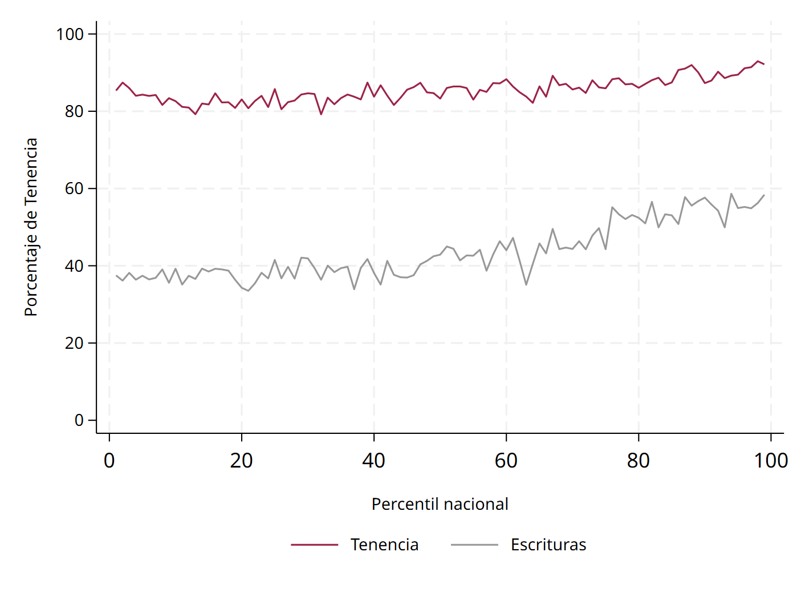{#fig-viv-tenencia}

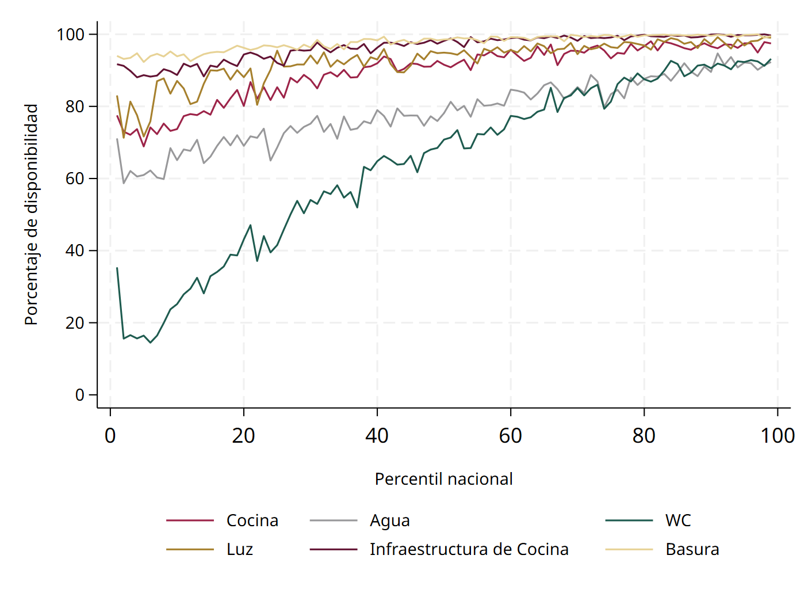{#fig-viv-disponibilidad}

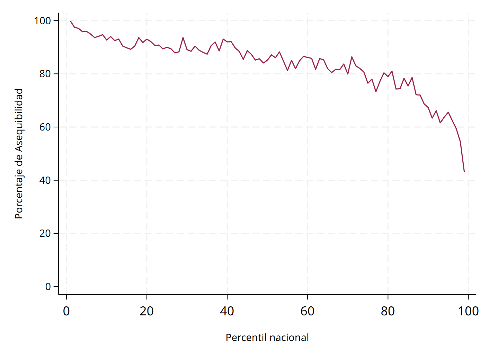{#fig-viv-asequibilidad}

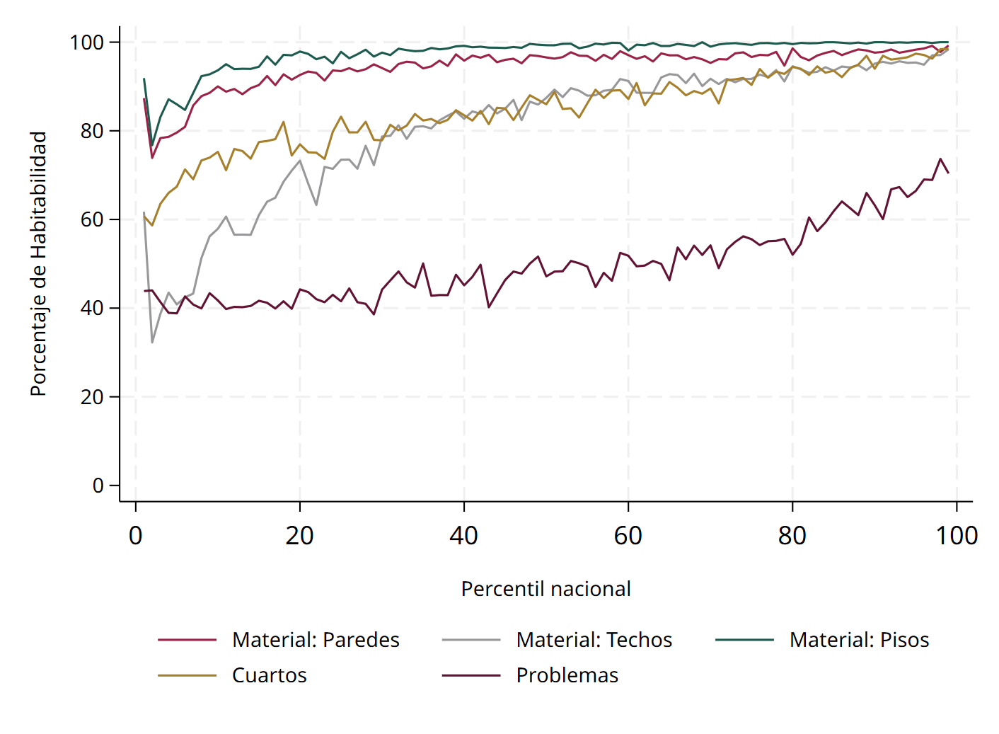{#fig-viv-habitabilidad}

Indicadores de vivienda digna por percentil del gasto en vivienda
:::

También se calcularon los tres criterios establecidos por CEPAL (unión, intersección e intermedio), para el establecimiento del estrato poblacional de referencia para el cálculo de la Canasta de Vivienda (@tbl-vivienda-criterios).

| Decil | Intermedio | Unión | Intersección |
|------:|-----------:|------:|-------------:|
| 1 | 84.4% | 99.6% | 3.8% |
| 2 | 82.4% | 99.0% | 6.3% |
| 3 | 84.4% | 99.0% | 8.8% |
| 4 | 87.4% | 99.1% | 13.9% |
| 5 | 87.8% | 99.1% | 16.6% |
| 6 | 89.3% | 99.2% | 19.3% |
| 7 | 91.1% | 99.2% | 22.4% |
| 8 | 91.6% | 99.0% | 25.6% |
| 9 | 93.7% | 99.3% | 30.4% |
| 10 | 93.3% | 99.4% | 30.8% |

: Criterios de selección del percentil de gasto en vivienda de referencia por decil del gasto en vivienda. {#tbl-vivienda-criterios}

En este caso, no se realiza una separación por ámbito, dado que las especificaciones de los Indicadores de Vivienda Digna incorporan explícitamente las diferencias que pudieran presentarse entre ámbitos, lo que permite un manejo adecuado de los datos y evita sesgos en las estimaciones. Para la identificación del estrato de referencia se utilizó un criterio basado en la distribución acumulada del cumplimiento de los Indicadores de Vivienda Digna. Por ende, se seleccionó el percentil 70 como estrato de referencia, ya que, bajo el criterio de unión el 99.2% de los hogares cumple con al menos uno de los indicadores de vivienda digna, el 91.1% de los hogares cumplen con al menos dos y 22.4% de los hogares ya cumple con los cuatro indicadores de vivienda digna.

Esta elección responde a que la metodología busca evitar puntos extremos de la distribución, particularmente percentiles cercanos al primer decil o a los niveles superiores de la distribución (por ejemplo, cercanos al percentil 90), ya que estos pueden representar condiciones atípicas y generar estimaciones poco representativas del gasto requerido para que una vivienda se considere digna. Una vez obtenido el estrato poblacional de referencia se utilizó una regresión cuantílica para el cálculo del gasto en vivienda digna que requiere un hogar en México, siguiendo la metodología de subcuentas nacionales; a diferencia de una regresión por Mínimos Cuadrados Ordinarios, la regresión cuantílica permite estimar la relación entre las características de la vivienda y el gasto en diferentes puntos de la distribución condicional del gasto, sin asumir que los efectos de las variables explicativas son constantes para todos los hogares. De modo que se tiene la siguiente especificación:

$$
\begin{aligned}
\ln(\text{gasto\_viv}) = {} & \text{entidad}_i + \beta_1\,\text{rural} + \beta_2\,\text{tenencia} + \beta_3\,\text{cocina} + \beta_4\,\text{agua} \\
& + \beta_5\,\text{sanitario} + \beta_6\,\text{luz} + \beta_7\,\text{infraestructura cocina} + \beta_8\,\text{basura} \\
& + \beta_9\,\text{asequibilidad} + \beta_{10}\,\text{paredes} + \beta_{11}\,\text{techos} + \beta_{12}\,\text{pisos} \\
& + \beta_{13}\,\text{cuartos} + \beta_{14}\,\text{problemas estructurales} + \epsilon_i
\end{aligned}
$$

Donde la variable dependiente corresponde al logaritmo natural del gasto en vivienda del hogar, *entidad* se refiere a la entidad federativa, *rural* al ámbito, y el resto de las variables hacen referencia a los componentes de los indicadores de vivienda digna antes establecidos. Debido a que la información proviene de una encuesta de hogares y que la estimación se realiza sobre un estrato específico de la distribución del gasto, se implementó un procedimiento de *bootstrap* con múltiples iteraciones. Este procedimiento permite obtener errores estándar robustos mediante el remuestreo de la información disponible, incorporando la variabilidad propia del diseño muestral y reduciendo la sensibilidad de los resultados ante cambios en la composición de la muestra. De esta manera, la inferencia estadística de los coeficientes no depende únicamente de una muestra particular de hogares, sino que considera la incertidumbre asociada al proceso de estimación. Es un procedimiento común cuando se trabajan datos de encuestas y se consideran variables declaradas (como el alquiler).

Los resultados muestran que la mayoría de los componentes asociados con una Vivienda Digna presentan efectos estadísticamente significativos sobre el gasto requerido (@tbl-vivienda-modelo). En términos generales, los coeficientes positivos indican que la presencia de las características de Vivienda Digna se relaciona con mayores niveles de gasto en vivienda, mientras que los coeficientes negativos reflejan características asociadas con menores requerimientos monetarios dentro del modelo.

| Variables | Coeficiente | Error estándar |
|-----------------------------|------------:|---------------:|
| Ámbito | -0.371\*\*\* | (0.00691) |
| Tenencia | 0.114\*\*\* | (0.00678) |
| Cuarto de cocina | 0.171\*\*\* | (0.00741) |
| Agua | 0.032\*\*\* | (0.00628) |
| Excusado | 0.272\*\*\* | (0.00809) |
| Energía eléctrica | 0.149\*\*\* | (0.00751) |
| Infraestructura de la cocina | 0.272\*\*\* | (0.01094) |
| Basura | 0.179\*\*\* | (0.01251) |
| Asequibilidad | -0.387\*\*\* | (0.00856) |
| Material: Paredes | 0.067\*\*\* | (0.01096) |
| Material: Techos | 0.160\*\*\* | (0.00645) |
| Material: Pisos | -0.065\*\*\* | (0.01010) |
| Hacinamiento | 0.141\*\*\* | (0.00668) |
| Problemas estructurales | 0.076\*\*\* | (0.00553) |
| Constante | 8.453\*\*\* | (0.02916) |

: Modelo del Gasto en Vivienda, ENIGH 2024. \*\*\* p\<0.01, \*\* p\<0.05, \* p\<0.1 {#tbl-vivienda-modelo}

El coeficiente asociado al ámbito rural presenta un valor negativo (-0.371), lo que indica que, manteniendo constantes las demás características de la vivienda, los hogares rurales presentan un gasto de vivienda menor respecto a los hogares urbanos. Este resultado refleja diferencias estructurales en materiales utilizados, precios de servicios y mercados inmobiliarios entre ambos ámbitos.

La variable de tenencia presenta un coeficiente positivo (0.114), sugiriendo que las condiciones relacionadas con la propiedad o seguridad de la vivienda se asocian con mayores niveles de gasto. Esto puede reflejar gastos adicionales realizados por hogares propietarios en mantenimiento, adecuaciones y mejoras del inmueble.

Dentro de los servicios básicos, destacan los efectos positivos asociados con la disponibilidad de excusado (0.272), infraestructura de cocina (0.272) y energía eléctrica (0.149). Estos resultados muestran que la incorporación de elementos esenciales para una Vivienda Digna incrementa el gasto asociado con alcanzar condiciones dignas, al requerir instalaciones, equipamiento y materiales adicionales.

Asimismo, las características constructivas presentan efectos positivos. Los materiales de techos (0.160), paredes (0.067) y la reducción de problemas estructurales (0.076) muestran que mejores condiciones físicas de la vivienda están asociadas con mayores requerimientos de gasto. El hacinamiento presenta un coeficiente positivo (0.141), lo que indica que una mayor disponibilidad de espacios habitacionales representa un componente relevante del costo de una vivienda digna.

Por otro lado, la variable de asequibilidad presenta un coeficiente negativo (-0.387). Este resultado es consistente con la naturaleza del indicador, debido a que una mayor carga relativa del gasto en vivienda representa una condición de vulnerabilidad y no necesariamente un atributo de calidad. Por ello, hogares con problemas de asequibilidad pueden ubicarse en niveles inferiores de gasto absoluto, aun cuando enfrenten mayores restricciones económicas.

En conjunto, los resultados muestran que el gasto requerido para una Vivienda Digna no depende únicamente del monto monetario destinado a vivienda, sino de un conjunto de características observables relacionadas con servicios, materiales, espacio disponible y condiciones de habitabilidad. La estimación cuantil permite obtener una referencia del gasto asociado con un nivel específico de cumplimiento de estas condiciones, proporcionando una medida más adecuada para representar los requerimientos económicos de una Vivienda Digna en México.

### Resultados

```{r}
#| label: setup-vivienda
#| echo: false
#| message: false
#| warning: false

viv_nac_rur <- sd |> filter(nom_ent == "Nacional", ambito == "Rural")  |> pull(vivienda_mensual)
viv_nac_urb <- sd |> filter(nom_ent == "Nacional", ambito == "Urbano") |> pull(vivienda_mensual)
viv_ent <- sd |> filter(nom_ent != "Nacional")
viv_max <- viv_ent |> slice_max(vivienda_mensual, n = 1)
viv_min <- viv_ent |> slice_min(vivienda_mensual, n = 1)
```

Una vez obtenidos los coeficientes de la regresión cuantílica estimada en escala logarítmica, se realizó la transformación inversa mediante la exponenciación de los valores predichos, con el objetivo de expresar los resultados en términos monetarios. De esta manera, el gasto en vivienda presentado corresponde al monto mensual estimado que requeriría un hogar para cubrir las condiciones asociadas con una Vivienda Digna.

A nivel nacional, el gasto mensual estimado asciende a `r fmt(viv_nac_rur)` pesos para los hogares rurales y a `r fmt(viv_nac_urb)` pesos para los hogares urbanos. Esta diferencia refleja las disparidades estructurales existentes entre ambos ámbitos, asociadas principalmente con los costos de los materiales, servicios, mantenimiento y condiciones del mercado inmobiliario. El comportamiento observado presenta una distribución similar a la encontrada para la Canasta Alimentaria, donde las entidades con mayores costos tienden a concentrarse en mercados con mayores niveles de precios. En particular, el ámbito `r tolower(viv_max$ambito)` de `r viv_max$nom_ent` presenta el mayor gasto estimado, con `r fmt(viv_max$vivienda_mensual)` pesos mensuales, mientras que el ámbito `r tolower(viv_min$ambito)` de `r viv_min$nom_ent` registra el menor valor, con `r fmt(viv_min$vivienda_mensual)` pesos mensuales.

En términos generales, las entidades que se ubican por encima del promedio nacional corresponden a aquellas donde los costos asociados con la vivienda presentan mayores presiones, derivadas de factores como la dinámica del mercado inmobiliario, los precios de los servicios y las condiciones regionales de construcción. Por el contrario, las entidades con valores inferiores reflejan menores costos relativos para alcanzar las mismas condiciones de Vivienda Digna.

Los valores obtenidos presentan una relación consistente con las estimaciones de referencia disponibles, lo que sugiere que la metodología empleada permite aproximar adecuadamente las diferencias regionales en los requerimientos monetarios asociados con una Vivienda Digna. La @fig-mapa-vivienda muestra la distribución del gasto mensual estimado por entidad federativa y ámbito.

```{=latex}
\begin{landscape}
```

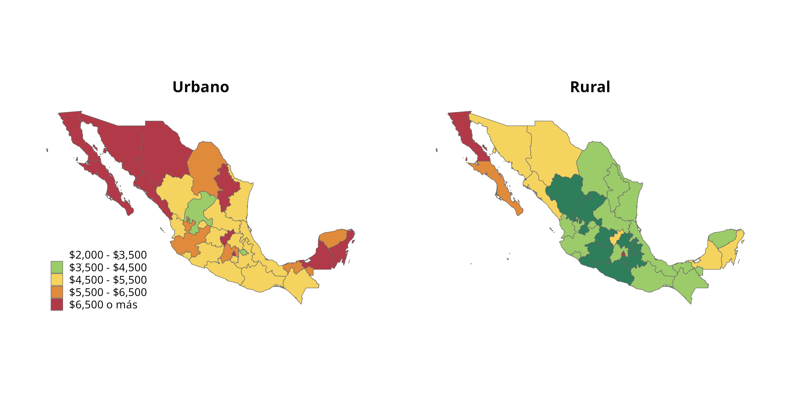{#fig-mapa-vivienda width=100%}

```{=latex}
\end{landscape}
```

## Canasta No Alimentaria y No Vivienda (NANV)

```{r}
#| label: setup-nanv
#| echo: false
#| message: false
#| warning: false

elast    <- read_csv("../finaldata/anexo/elasticidades.csv",          show_col_types = FALSE)
bienes   <- read_csv("../finaldata/anexo/hogares_nanv_bienestar.csv", show_col_types = FALSE)
perc_ref <- read_csv("../finaldata/nanv/2.percentiles_nanv.csv",       show_col_types = FALSE)

fmt_pct <- function(x) paste0(format(round(100 * x, 1), nsmall = 1), "%")

# Rango de la elasticidad-ingreso (regresor: gasto monetario) por categoría,
# sobre los dos métodos (Log-Log y Working-Leser) y los tres ámbitos.
rng_eta <- function(cat) {
  v <- elast |> filter(categoria == cat, regresor == "gasto_mon") |> pull(elasticidad)
  sprintf("%s y %s", fmt2(min(v)), fmt2(max(v)))
}

# Índice de bienestar (0–4) y cumplimiento por grupo.
bg <- function(g, col) bienes |> filter(grupo == g) |> pull({{ col }})

# Percentil de referencia (inverse_result) por entidad, excluyendo el Nacional.
perc_ent <- perc_ref |> filter(nom_ent != "Nacional")
perc_min <- perc_ent |> slice_min(percentil_referencia, n = 2) |> arrange(percentil_referencia)
perc_max <- perc_ent |> slice_max(percentil_referencia, n = 1)

# Montos de la Canasta Digna de la Ciudad de México por ámbito.
sd_cdmx <- function(amb) sd |> filter(nom_ent == "Ciudad de México", ambito == amb) |> pull(salario_digno)

# Canasta NANV: extremos por entidad y valores nacionales por ámbito.
canasta_n    <- read_csv("../finaldata/nanv/1.canasta_nanv.csv", show_col_types = FALSE) |>
  mutate(ambito = if_else(rural == 1, "Rural", "Urbano"))
nanv_ent     <- canasta_n |> filter(nom_ent != "Nacional")
nanv_min     <- nanv_ent |> slice_min(NANV, n = 1)
nanv_max     <- nanv_ent |> slice_max(NANV, n = 1)
nanv_nac_rur <- canasta_n |> filter(nom_ent == "Nacional", ambito == "Rural")  |> pull(NANV)
nanv_nac_urb <- canasta_n |> filter(nom_ent == "Nacional", ambito == "Urbano") |> pull(NANV)
# CDMX por ámbito (caso de inversión rural > urbano que ancla la subsección siguiente).
nanv_cdmx_rur <- canasta_n |> filter(nom_ent == "Ciudad de México", ambito == "Rural")  |> pull(NANV)
nanv_cdmx_urb <- canasta_n |> filter(nom_ent == "Ciudad de México", ambito == "Urbano") |> pull(NANV)
```

### Introducción

Los gastos y necesidades que enfrentan los hogares son diversos y un tratamiento individual dificultaría su implementación y daría menor confianza a su estimación. Por esa razón, el rubro de gasto en NANV se define como un nivel apropiado dentro de la distribución del gasto monetario corriente necesario para cubrir los gastos que no se refieren a la alimentación ni a la vivienda, tal como el nombre señala; esto puede incluir gastos asociados a la educación, salud, transporte, entre otros rubros. Se parte del supuesto de que un hogar que habita una vivienda digna realiza también un gasto adecuado en NANV, de modo que el valor estimado de la Canasta de Vivienda permite identificar el nivel de gasto que le corresponde por entidad y ámbito[^elasticidades-nanv]. La vivienda es un rubro apropiado para relacionarlo con el gasto corriente porque, a diferencia del gasto en alimentos, es un bien normal respecto al ingreso: es decir, los hogares tienden a destinar una mayor proporción a vivienda y una menor a alimentos cuando su ingreso aumenta [@anker2011engel].

[^elasticidades-nanv]: Como prueba de robustez sobre este supuesto se estimaron las elasticidades ingreso gasto para los tres rubros: gasto en alimentos, vivienda y NANV. Conforme a lo esperado, se encontró que el gasto en alimentos tiene una menor elasticidad que vivienda, y, por lo tanto, esta última resulta una mejor variable para aproximar la Canasta NANV. Véase el [anexo VII](#sec-anexo-vii).

El objetivo es identificar un nivel apropiado del gasto NANV como función del gasto en una vivienda digna. La relación se construye entre el gasto en vivienda per cápita (la suma de alquiler o alquiler estimado más los servicios de la vivienda, dividida entre el número de integrantes del hogar) y la probabilidad acumulada del gasto corriente monetario per cápita^[La probabilidad acumulada del gasto corriente indica la posición relativa de cada hogar con respecto a la distribución del gasto corriente.]. Antes de ajustar el modelo se excluyen los hogares que no reportan gasto en vivienda y, dentro de cada combinación de entidad y ámbito, se recortan las colas de la distribución del gasto corriente conservando los percentiles 5 a 95 para evitar valores atípicos. Sobre la muestra recortada se calcula la probabilidad acumulada como el rango del gasto corriente ponderado por el factor de expansión, de manera que cada hogar queda situado en una posición entre 0 y 1 dentro de su distribución. Los modelos nacionales emplean el rango calculado sobre la distribución nacional agrupada por ámbito, mientras que los modelos por entidad usan el rango interno de cada entidad y ámbito.

Sobre esa relación se ajusta un modelo aditivo con restricción de forma (SCAM, por sus siglas en inglés), monotónico creciente, implementado con el paquete `scam` de R mediante una P-spline cuya base impone la monotonía. La variable dependiente es el gasto en vivienda per cápita y el regresor es la probabilidad acumulada del gasto corriente, es decir, la posición relativa del hogar en el intervalo de 0 a 1. Imponer la monotonía creciente garantiza una función estrictamente creciente e invertible. El procedimiento se repite para cada zona de representatividad; a nivel nacional por ámbito y para cada combinación de entidad y ámbito. La @fig-engel-vivienda-nac ilustra el caso del ámbito urbano a nivel nacional, la línea guinda representa los valores predichos por el modelo monotónico y la verde un suavizado por regresión local ponderada (LOESS, por sus siglas en inglés) que sirve de comparación.

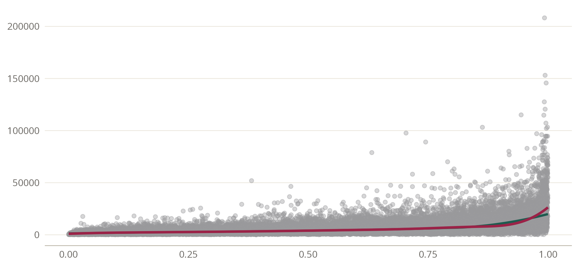{#fig-engel-vivienda-nac}

Con el modelo ajustado se estima su función inversa. Como la función es estrictamente creciente, a cada valor del gasto en vivienda le corresponde un único percentil de la distribución del gasto corriente. Se busca por métodos numéricos el percentil de referencia `p*` cuyo gasto en vivienda predicho iguala el valor per cápita de la Canasta de Vivienda (el monto del hogar de referencia dividido entre cuatro, considerando el tamaño del hogar de referencia). Identificado ese percentil, el gasto NANV se obtiene como el promedio del gasto corriente monetario per cápita de los hogares situados en la banda `[p*, p*+0.10]`, es decir, los diez puntos porcentuales de la distribución que se ubican por encima del percentil de referencia. Ese promedio se estima respetando el diseño muestral complejo de la ENIGH (estratos, unidades primarias de muestreo y factores de expansión, con ajuste para las unidades primarias solitarias). 

### Resultados

Para cada zona de representatividad se usó su respectiva función inversa y el valor de la Canasta de Vivienda para identificar un percentil de su distribución a partir del cual el nivel de gasto per cápita en vivienda se considera razonable. La @fig-percentiles-nanv muestra los valores estimados para cada entidad por ámbito. El ordenamiento hace aparente el efecto de la estratificación de la vivienda en México: los hogares que habitan viviendas dignas suelen tener los ingresos más altos, en particular en entidades de menores recursos o de ámbito rural. Los menores valores se ubican en el ámbito rural de `r perc_min$nom_ent[1]` y `r perc_min$nom_ent[2]` (alrededor de `r fmt_pct(perc_min$percentil_referencia[1])` de la distribución); el valor máximo corresponde al ámbito urbano de `r perc_max$nom_ent` (`r fmt_pct(perc_max$percentil_referencia)`), un resultado esperado por la marcada diferencia en las condiciones de vivienda entre el norte y el sur del país.

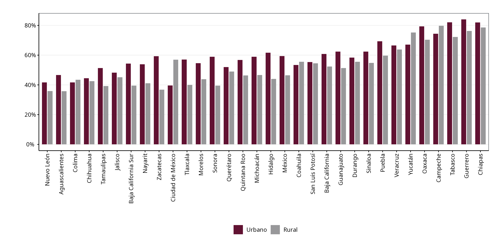{#fig-percentiles-nanv}

El valor mínimo estimado de la Canasta NANV se ubicó en el ámbito `r tolower(nanv_min$ambito)` de `r nanv_min$nom_ent`, con `r fmt(nanv_min$NANV)` pesos mensuales por persona; el valor más alto correspondió a `r nanv_max$nom_ent` `r tolower(nanv_max$ambito)`, con `r fmt(nanv_max$NANV)` pesos mensuales. El valor nacional fue de `r fmt(nanv_nac_rur)` pesos mensuales en el ámbito rural y `r fmt(nanv_nac_urb)` en el urbano. A diferencia de la Canasta Alimentaria, varios de los montos más altos aparecen en el ámbito rural; en la Ciudad de México, por ejemplo, el gasto NANV de referencia del ámbito rural (`r fmt(nanv_cdmx_rur)` pesos) supera al del urbano (`r fmt(nanv_cdmx_urb)` pesos). Este resultado es coherente con el ordenamiento de percentiles descrito: en el ámbito rural los hogares que habitan viviendas dignas se ubican en posiciones más altas de la distribución del gasto corriente, por lo que el gasto NANV que les corresponde también resulta mayor. La @fig-mapa-nanv presenta el valor estimado por entidad y ámbito.

```{=latex}
\begin{landscape}
```

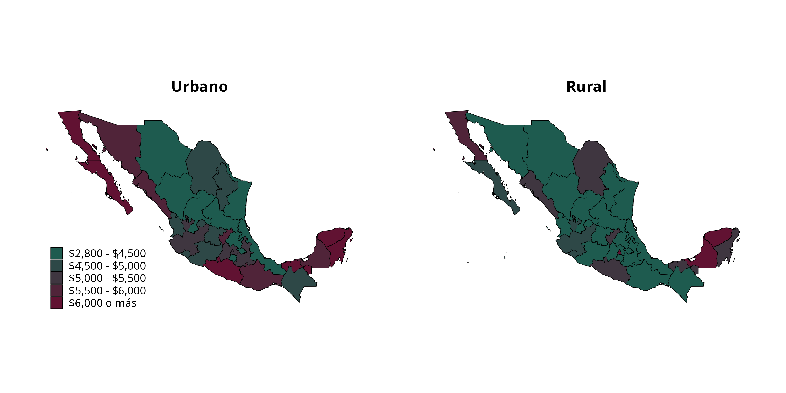{#fig-mapa-nanv width=100%}

```{=latex}
\end{landscape}
```

## Salario Digno

```{r}
#| label: setup-salario
#| echo: false
#| message: false
#| warning: false

# Ingreso digno familiar neto nacional por ámbito (puente explicativo).
idf_nac_rur <- sd |> filter(nom_ent == "Nacional", ambito == "Rural")  |> pull(ingreso_digno_familiar)
idf_nac_urb <- sd |> filter(nom_ent == "Nacional", ambito == "Urbano") |> pull(ingreso_digno_familiar)

# Componentes nacionales netos por ámbito (para el cierre de Conclusiones).
comp_nac <- function(amb, var) sd |> filter(nom_ent == "Nacional", ambito == amb) |> pull({{ var }})
ali_fam_rur  <- comp_nac("Rural",  alimentos_familiar)
ali_fam_urb  <- comp_nac("Urbano", alimentos_familiar)
viv_rur      <- comp_nac("Rural",  vivienda_mensual)
viv_urb      <- comp_nac("Urbano", vivienda_mensual)
nanv_fam_rur <- comp_nac("Rural",  nanv_familiar)
nanv_fam_urb <- comp_nac("Urbano", nanv_familiar)

# Salario digno neto de una entidad y ámbito (comparación sur-norte).
sd_val <- function(ent, amb) {
  sd |> filter(nom_ent == ent, ambito == amb) |> pull(salario_digno)
}
```

Para obtener el ingreso digno neto de un hogar se suman los montos estimados de la Canasta de Alimentos, Vivienda y NANV, y al resultado se le agrega 5% por concepto de ahorro o gastos inesperados, siguiendo la metodología de Anker [@anker2017livingwages]. Este monto representa el gasto que un hogar promedio de cuatro integrantes necesita para alcanzar una vida digna. A nivel nacional, el ingreso digno familiar neto se estimó en `r fmt(idf_nac_rur)` pesos mensuales en el ámbito rural y `r fmt(idf_nac_urb)` en el urbano.

El salario digno neto se obtiene al dividir el ingreso digno del hogar entre el número de personas trabajadoras del hogar de referencia, dos en este caso, y corresponde al ingreso que cada persona trabajadora debería percibir por una jornada regular. Es el monto neto, previo a la retención del ISR.

El valor nacional del salario digno neto fue de `r fmt(sd_nac_rur)` pesos mensuales por persona trabajadora en el ámbito rural y `r fmt(sd_nac_urb)` en el urbano. El valor más alto se observó en el ámbito `r tolower(sd_max$ambito)` de `r sd_max$nom_ent`, con `r fmt(sd_max$salario_digno)` pesos mensuales; el más bajo, en el ámbito `r tolower(sd_min$ambito)` de `r sd_min$nom_ent`, con `r fmt(sd_min$salario_digno)` pesos mensuales. La @fig-mapa-salario presenta el valor estimado por entidad y ámbito.

```{=latex}
\begin{landscape}
```

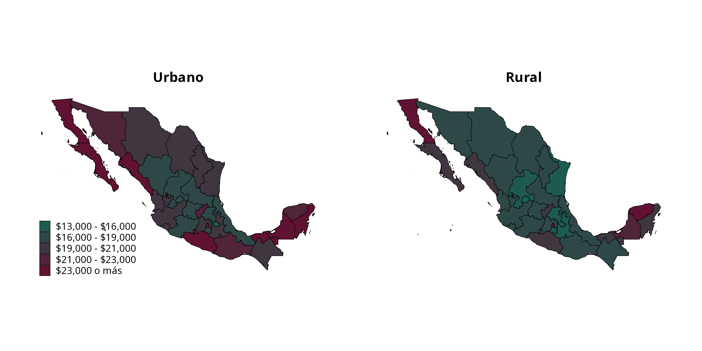{#fig-mapa-salario width=100%}

```{=latex}
\end{landscape}
```

Varias entidades del sur registran salarios dignos superiores a los de entidades del norte habitualmente asociadas con mayores ingresos. En el ámbito urbano, Quintana Roo, Tabasco y Guerrero (con `r fmt(sd_val("Quintana Roo", "Urbano"))`, `r fmt(sd_val("Tabasco", "Urbano"))` y `r fmt(sd_val("Guerrero", "Urbano"))` pesos mensuales, respectivamente) rebasan a Nuevo León (`r fmt(sd_val("Nuevo León", "Urbano"))` pesos); en el rural, Yucatán (`r fmt(sd_val("Yucatán", "Rural"))` pesos) se ubica por encima de todas las entidades del norte, incluida Baja California (`r fmt(sd_val("Baja California", "Rural"))` pesos). Este resultado es coherente con la metodología, pues dadas las brechas y disparidades geográficas históricas, para los estados del sur el camino a recorrer para alcanzar el nivel de dignidad señalado en la Constitución es mayor. Así, el monto considerado como salario digno refleja estas necesidades adicionales que permitirán cerrar las brechas entre regiones. Reconocer estas diferencias evita fijar umbrales de dignidad artificialmente bajos para el sur y contribuye a no perpetuar las desigualdades regionales.

La brecha proviene sobre todo de los componentes de vivienda y NANV; debido a que el gasto en NANV se ancla al nivel de gasto corriente que un hogar necesita para acceder a una vivienda digna, alcanzar condiciones de habitabilidad resulta más costoso en el ámbito rural. Por ejemplo, ante una menor cobertura de infraestructura y servicios públicos como agua entubada, drenaje o recolección de residuos, ambos componentes se elevan. En el [anexo VII](#sec-anexo-vii) se presenta un análisis de este efecto.

<!--
PENDIENTE: salario digno bruto (neto + retención de ISR). Cifras previas conservadas:
El Salario Digno se obtiene al dividir el Ingreso Digno del Hogar entre el número de personas trabajadoras en el hogar, y se le agrega la correspondiente retención por ISR para obtener el salario que una persona trabajadora debería de percibir. El valor máximo lo presentó Baja California con un estimado de 27,116.82 y 33,181.02 pesos mensuales por persona trabajadora para el ámbito rural y urbano, respectivamente.
El estimado a nivel nacional fue de 19,515.19 pesos mensuales en el ámbito rural y de 23,227.09 pesos mensuales en el urbano. Esto está conformado por 17,091.64 y 20,010.68 pesos mensuales correspondientes al valor de la Canasta Digna neta, y 2,423.55 y 3,216.41 pesos mensuales correspondientes a la retención del ISR, para ámbito rural y urbano, respectivamente.
-->


# Conclusiones

La Canasta Digna de la Conasami es una herramienta que busca estimar un umbral monetario suficiente que les permita a las personas trabajadoras mantener una vida digna y el pleno cumplimiento de sus derechos humanos. Fue elaborada adaptando la metodología de estimaciones subnacionales de Richard y Martha Anker, junto con la propuesta para la selección de estratos poblacionales de referencia de la CEPAL. Se compone de una Canasta Alimentaria, una Canasta de Vivienda y una Canasta NANV que representan el gasto en cada uno de sus respectivos rubros. El resultado final es el salario digno por una jornada regular de una persona trabajadora.

El ingreso digno neto de un hogar a nivel nacional se estimó en `r fmt(idf_nac_rur)` pesos mensuales en el ámbito rural y `r fmt(idf_nac_urb)` en el urbano, para el hogar de referencia de cuatro integrantes con dos personas trabajadoras y dos personas dependientes económicas. Se compone de un consumo en alimentos de `r fmt(ali_fam_rur)` y `r fmt(ali_fam_urb)` pesos, un gasto en vivienda de `r fmt(viv_rur)` y `r fmt(viv_urb)` pesos, y un consumo en NANV de `r fmt(nanv_fam_rur)` y `r fmt(nanv_fam_urb)` pesos mensuales, para el ámbito rural y urbano respectivamente, a lo que se agrega 5% por ahorro o imprevistos. Considerando que ambas personas trabajadoras del hogar cumplen una jornada completa, a nivel nacional la Canasta Digna neta por persona se estimó en `r fmt(sd_nac_rur)` pesos mensuales en el ámbito rural y `r fmt(sd_nac_urb)` en el urbano.

<!--
NOTA PARA HÉCTOR: revisar estas cifras BRUTAS antes de publicar.
Provienen del borrador previo (comentario PENDIENTE de la sección "Salario digno");
incluyen la retención de ISR estimada y NO se calculan inline desde salario_digno.csv
(no hay columna de salario bruto). Verificar el cálculo de ISR y, si se confirma,
considerar moverlas a inline cuando exista la columna correspondiente.
-->

En términos brutos, el salario digno nacional se estimó en 19,515.19 pesos mensuales por persona trabajadora en el ámbito rural y 23,227.09 en el urbano; de estos montos, 2,423.55 y 3,216.41 pesos corresponden a la retención de ISR en cada ámbito. El valor bruto más alto se observó en Baja California, con 27,116.82 pesos en el ámbito rural y 33,181.02 en el urbano.

La metodología adoptada permite avanzar en el estudio de las condiciones de vida de las personas trabajadoras con el uso exclusivo de encuestas de ingresos y gastos. La cercanía con otros ejercicios para México (los estudios *benchmark* del Instituto Anker para zonas productoras, la estimación subnacional para la Ciudad de México y las aplicaciones del *MIT Living Wage Calculator*) da confianza en su validez [@anker2024cdmx; @galdamez2019cdmx].

Esta primera estimación abre varias líneas de trabajo para las metodologías para la estimación de salarios dignos en México y países en vías de desarrollo. El Salario Digno se construye para un hogar de referencia de cuatro integrantes con dos personas trabajadoras, pero es posible extenderla a hogares con distinto número de dependientes o de perceptores. En la misma dirección, se explora estimar la Canasta Digna por ocupación, lo que exige verificar antes la precisión estadística de los estimadores por grupo del SINCO, pues la desagregación reduce el tamaño de muestra y puede comprometer su confianza estadística. Una línea adicional es la estimación para composiciones de hogar con perspectiva de género, mediante estimaciones diferenciadas que reconozcan las brechas en la jefatura del hogar, la participación laboral y roles de género, en línea con el principio de igualdad de género de los criterios de la OIT. Combinar estas estimaciones con estudios *benchmark* y de caso de mayor profundidad, que incorporan datos primarios y consulta con los actores involucrados, permitiría validar y afinar los supuestos de la estimación subnacional en localidades específicas [@anker2017livingwages; @prates2024subnational].

En el plano de la política pública, esta estimación constituye el primer paso técnico para informar la progresión gradual del salario mínimo hacia el salario digno que ordena la Constitución y que respalda el consenso tripartito dentro de la Conasami y de la OIT [@ilo2024conclusiones]. Con este ejercicio se refrenda el compromiso de continuar avanzando hacia el cumplimiento de un nivel de vida digno para toda la población trabajadora del país.

# Referencias {.unnumbered}

::: {#refs}
:::

# Anexos

## Anexo I. Coeficientes de variación {#sec-anexo-i}

El cuadro siguiente reporta el coeficiente de variación del gasto en alimentos, vivienda, NANV y gasto corriente para cada zona de representatividad (entidad federativa y ámbito), con el renglón nacional al inicio. Siguiendo los criterios del INEGI, un coeficiente inferior a 15% indica confianza alta, entre 15% y 30% confianza media y superior a 30% confianza baja.

```{r}
#| label: tbl-representatividad-cv
#| echo: false
#| message: false
#| warning: false
#| tbl-cap: "Coeficiente de variación del gasto por entidad, ámbito y rubro."

pacman::p_load(dplyr, tidyr, knitr, kableExtra)

pct <- function(x) ifelse(is.na(x), "", paste0(format(round(x * 100, 1), nsmall = 1), "%"))

rubros_ord <- c("Alimentos", "Vivienda", "NANV", "Gasto corriente")

cv_wide <- rep_cv |>
  filter(ambito %in% c("Urbano", "Rural")) |>
  mutate(rubro = factor(rubro, levels = rubros_ord)) |>
  select(nom_ent, ambito, rubro, cv) |>
  pivot_wider(names_from = c(ambito, rubro), values_from = cv,
              names_sep = "__", names_sort = TRUE)

# Nacional hasta arriba; entidades en orden alfabético.
cv_wide <- bind_rows(
  cv_wide |> filter(nom_ent == "Nacional"),
  cv_wide |> filter(nom_ent != "Nacional") |> arrange(nom_ent)
)

ord_cols <- paste(rep(c("Urbano", "Rural"), each = length(rubros_ord)), rubros_ord, sep = "__")

tab <- cv_wide |>
  select(nom_ent, all_of(ord_cols)) |>
  mutate(across(-nom_ent, pct))

col_nm <- c("Entidad", rep(rubros_ord, 2))

kbl(tab, booktabs = TRUE, longtable = TRUE, col.names = col_nm,
    align = c("l", rep("r", 8))) |>
  kable_styling(latex_options = "repeat_header", font_size = 8, full_width = FALSE) |>
  add_header_above(c(" " = 1, "Urbano" = 4, "Rural" = 4)) |>
  column_spec(1, width = "2.6cm") |>
  column_spec(2:9, width = "1.7cm") |>
  row_spec(1, bold = TRUE) |>
  footnote(general = "Confianza alta si el coeficiente de variación es inferior a 15%, media entre 15% y 30%, y baja si supera 30% (criterios INEGI). Fuente: elaboración propia con datos de la ENIGH 2024.",
           general_title = "", footnote_as_chunk = TRUE) |>
  landscape()
```

## Anexo II. Metadatos de Canasta de Vivienda {#sec-anexo-ii}

El cuadro siguiente documenta los indicadores con los que se clasifica a una vivienda como digna conforme a los criterios de ONU-Hábitat. Los indicadores se agrupan en los cuatro componentes de la vivienda digna (tenencia, disponibilidad, asequibilidad y habitabilidad); para cada uno se detalla su objetivo, la pregunta de la ENIGH 2024 de la que proviene, la codificación que distingue su cumplimiento (1) del incumplimiento (0) y la justificación normativa correspondiente.

```{=latex}
\begin{landscape}\footnotesize
```

| Indicador | Objetivo | Pregunta ENIGH | Codificación | Justificación |
| ---------- | ------------ | -------------------- | -------------------------- | ----------------- |
| **Tenencia** | | | | |
| **1.1:** Tenencia | Clasificar las viviendas por su dominio o posesión legal. | Se utilizó la pregunta 26 de la Sección I del Cuestionario de Hogares y vivienda: "¿Esta vivienda…" | **0 =** Dominio o posesión legal no en regla (no tenencia): se agruparon las respuestas 2) es prestada, 5) está intestada o en litigio y 6) otra situación. **1 =** Dominio o posesión legal en regla (tenencia): se agruparon las respuestas 1) es rentada, 3) es propia, pero la están pagando, y 4) es propia. | Esta clasificación se alinea con el criterio de ONU-Hábitat sobre tenencia, donde se requieren las condiciones que garanticen a sus ocupantes protección jurídica contra desalojo, hostigamiento o amenazas. |
| **1.2:** Tenencia | Clasificar las viviendas por su dominio o posesión legal. | Se utilizó la pregunta 31 de la Sección I del Cuestionario de Hogares y vivienda: "¿Esta vivienda cuenta con escrituras o título de propiedad…" | **0 =** Dominio o posesión legal no en regla (no escrituras): se agruparon las respuestas 3) no tiene escrituras y 4) no sabe. **1 =** Dominio o posesión legal en regla (escrituras): se agruparon las respuestas 1) a nombre de la dueña o dueño, y 2) a nombre de otra persona y cumple con el indicador 1.1. | Esta clasificación se alinea con el criterio de ONU-Hábitat sobre tenencia, donde se requieren las condiciones que garanticen a sus ocupantes protección jurídica contra desalojo, hostigamiento o amenazas. |
| **1.3:** Tenencia | Viviendas que cumplen con los parámetros del indicador de tenencia. | | **0 =** No cumple con el indicador de Tenencia: ninguno o solo uno de los indicadores anteriores es igual a 1. **1 =** Cumple con el indicador de Tenencia: los dos indicadores anteriores son igual a 1. | Se cumple con el criterio de ONU-Hábitat sobre tenencia, donde se requieren las condiciones que garanticen a sus ocupantes protección jurídica contra desalojo, hostigamiento o amenazas. |
| **Disponibilidad** | | | | |
| **2.1:** Disponibilidad de espacio para cocinar | Clasificar las viviendas según la disponibilidad de un espacio específico y exclusivo para cocinar. | Se utilizaron las preguntas 6 y 7 de la Sección I del Cuestionario de Hogares y vivienda: "¿Esta vivienda tiene un cuarto para cocinar?" y "¿En el cuarto donde cocinan también duermen?" | **0 =** No tiene cocina disponible: incluye viviendas que no tienen cuarto de cocina o que, teniéndolo, lo usan también como dormitorio. **1 =** Tiene cocina disponible: viviendas que tienen un cuarto de cocina y que no lo usan como dormitorio. | Esta clasificación se alinea con el criterio de ONU-Hábitat sobre disponibilidad, donde se contemplan los diferentes servicios, materiales, instalaciones e infraestructura que debe tener una vivienda para considerarse digna, tal es el caso de la provisión de agua, instalaciones sanitarias adecuadas, energía para la cocción, calefacción y alumbrado, así como para la conservación de alimentos y eliminación de residuos. |
| **2.2:** Disponibilidad de agua | Clasificar las viviendas según la disponibilidad de agua entubada, con abastecimiento suficiente y dotación adecuada. | Se agruparon las preguntas 11, 12, 13 y 14 de la Sección I del Cuestionario de Hogares y vivienda: "¿El agua la obtienen de llaves o mangueras que están…", "¿El agua que usan en su vivienda proviene…", "Entonces, ¿acarrean el agua de…" y "¿Cuántos días a la semana llega el agua a esta vivienda?" | **0 =** No tiene agua disponible y suficiente: No tiene agua entubada (Pregunta 11 respuesta 3), el abastecimiento del agua (Pregunta 12) proviene de otra vivienda (respuesta 5), de la lluvia sin inscripción al programa PROCAPTAR (respuesta 6) o de otro lugar (respuesta 7); el agua es acarreada (Pregunta 13) de un pozo (respuesta 1), una llave comunitaria (respuesta 2), otra vivienda (respuesta 3), un río, arroyo o lago (respuesta 4) o de la lluvia sin inscripción al programa PROCAPTAR (respuesta 6); y la frecuencia de abastecimiento (Pregunta 14) es dos veces por semana (respuesta 3), una vez por semana (respuesta 4) o de vez en cuando (respuesta 5). **1 =** Tiene agua disponible y suficiente: Tiene agua entubada (Pregunta 11 respuestas 1 y 2), el abastecimiento del agua (Pregunta 12) proviene del servicio público de agua (respuesta 1), de un pozo comunitario (respuesta 2), de un pozo particular (respuesta 3), de una pipa (respuesta 4) o de la lluvia con inscripción al programa PROCAPTAR (respuesta 6); el agua es acarreada (Pregunta 13) de una pipa (respuesta 5) o de la lluvia con inscripción al programa PROCAPTAR (respuesta 6); y la frecuencia de abastecimiento (Pregunta 14) es diario (respuesta 1) o cada tercer día (respuesta 2). | Esta clasificación se alinea con el criterio de ONU-Hábitat sobre disponibilidad, donde se contemplan los diferentes servicios, materiales, instalaciones e infraestructura que debe tener una vivienda para considerarse digna, tal es el caso de la provisión de agua. |
| **2.3:** Disponibilidad de infraestructura y servicios sanitarios | Clasificar las viviendas según la disponibilidad de instalaciones sanitarias adecuadas y exclusivas. | Se agruparon las preguntas 15, 16, 17 y 20 de la Sección I del Cuestionario de Hogares y vivienda: "¿Tienen…", "¿La taza de baño (letrina) es compartida con otra vivienda?", "¿La taza de baño (letrina)…" y "¿Esta vivienda tiene drenaje o desagüe conectado a…" | **0 =** No tiene sanitario disponible: Falta de excusado o instalación sanitaria (Pregunta 15, respuesta 3), o se comparte con otras viviendas (Pregunta 16, respuesta 1), o no tiene conexión al agua (Pregunta 17) y le echan agua con cubeta (respuesta 2) o no se le puede echar agua (respuesta 3), o carece de drenaje (Pregunta 20, respuestas 2, 3, 4, 5). **1 =** Tiene sanitario disponible: Viviendas con excusado o instalación sanitaria (Pregunta 15 respuestas 1 y 2), de uso exclusivo del hogar (Pregunta 16 respuesta 2), con conexión al agua (Pregunta 17 respuesta 1) y drenaje conectado a la red pública (Pregunta 20 respuesta 1). | Esta clasificación se alinea con el criterio de ONU-Hábitat sobre disponibilidad, donde se contemplan los diferentes servicios, materiales, instalaciones e infraestructura que debe tener una vivienda para considerarse digna, tal es el caso de instalaciones sanitarias adecuadas. |
| **2.4:** Disponibilidad de servicio de energía eléctrica | Clasificar las viviendas según la disponibilidad de servicio de energía eléctrica formal. | Se agruparon las preguntas 21 y 32 de la Sección I del Cuestionario de Hogares y vivienda: "¿En esta vivienda la luz eléctrica la obtienen…" y "¿Esta vivienda tiene medidor de luz?" | **0 =** No tiene servicio de luz disponible: La fuente de donde se obtiene la energía eléctrica (Pregunta 21) es de una planta particular (respuesta 2), de otra fuente (respuesta 4) o no tiene luz eléctrica (respuesta 5), o tiene servicio sin medidor (Pregunta 32 respuesta 2). **1 =** Tiene servicio de luz disponible: Viviendas con servicio público (Pregunta 21, respuesta 1) o de panel solar (respuesta 3) y que cuentan con medidor propio (Pregunta 32 respuesta 1). | Esta clasificación se alinea con el criterio de ONU-Hábitat sobre disponibilidad, donde se contemplan los diferentes servicios, materiales, instalaciones e infraestructura que debe tener una vivienda para considerarse digna, tal es el caso de la provisión de energía para la cocción, calefacción y alumbrado, así como para la conservación de alimentos. |
| **2.5:** Disponibilidad de infraestructura para cocinar | Clasificar las viviendas según la disponibilidad de infraestructura adecuada para la cocción de alimentos. | Se agruparon las preguntas 23 y 24 de la Sección I del Cuestionario de Hogares y vivienda: "¿El combustible que más usan para cocinar es…" y "¿El fogón (anafre, estufa, comal) donde cocinan con leña o carbón…?" | **0 =** No tiene buena infraestructura para cocina: Viviendas con combustibles inadecuados (Pregunta 23, respuestas 1 y 2) o, en zonas rurales, uso de leña/carbón sin chimenea (Pregunta 23, respuestas 1 y 2, y Pregunta 24, respuesta 2). **1 =** Tiene buena infraestructura para cocina: Viviendas con uso de gas o electricidad (Pregunta 23, respuestas 3, 4 y 5) o, en zonas rurales, uso de leña/carbón con chimenea (Pregunta 23, respuestas 1 y 2, y Pregunta 24, respuesta 1). | Esta clasificación se alinea con el criterio de ONU-Hábitat sobre disponibilidad, donde se contemplan los diferentes servicios, materiales, instalaciones e infraestructura que debe tener una vivienda para considerarse digna, tal es el caso de la provisión de energía para la cocción. |
| **2.6:** Disponibilidad de servicios o procesos de eliminación de desechos | Clasificar las viviendas según la disponibilidad de métodos adecuados para la eliminación de basura. | Se utilizaron las respuestas de la pregunta 25 de la Sección I del Cuestionario de Hogares y vivienda: "¿La basura de esta vivienda…" | **0 =** No tiene eliminación adecuada de desechos: Viviendas con métodos inadecuados para eliminar la basura, como la queman (respuesta 4), la entierran (respuesta 5) sin estar en un ambiente rural, la tiran en un terreno baldío o calle (respuesta 6), la tiran en barranca o grieta (respuesta 7) o la tiran al río, lago o mar (respuesta 8). **1 =** Tiene eliminación adecuada de desechos: Viviendas con métodos adecuados para eliminar basura, como dársela a un camión o carrito de basura (respuesta 1), llevarla al basurero público (respuesta 2), dejarla en un contenedor o depósito (respuesta 3) o, estando en un ambiente rural, quemarla o enterrarla (respuestas 4 y 5). | Esta clasificación se alinea con el criterio de ONU-Hábitat sobre disponibilidad, donde se contemplan los diferentes servicios, materiales, instalaciones e infraestructura que debe tener una vivienda para considerarse digna, tal es el caso de las formas adecuadas de eliminar basura de la vivienda. |
| **2.7:** Disponibilidad | Viviendas que cumplen con los parámetros del indicador de disponibilidad. | | **0 =** No cumple con el indicador de Disponibilidad: Ninguno o menos de 6 de los indicadores anteriores es igual a 1. **1 =** Cumple con el indicador de Disponibilidad: Todos los indicadores anteriores son igual a 1. | Esta clasificación se alinea con el criterio de ONU-Hábitat sobre disponibilidad, donde se contemplan los diferentes servicios, materiales, instalaciones e infraestructura que debe tener una vivienda para considerarse digna, tal es el caso de la provisión de energía para la cocción, calefacción y alumbrado, así como para la conservación de alimentos. |
| **Asequibilidad** | | | | |
| **3.1:** Asequibilidad | Clasificar las viviendas por su proporción del ingreso corriente destinado a gasto en vivienda. | Se utilizaron las variables de gasto en vivienda (alquiler, servicios de luz, agua, predial) e ingreso corriente del hogar. | **0 =** Gasto inadecuado en vivienda: Viviendas que destinan el 30% o más de sus ingresos al gasto en vivienda. **1 =** Vivienda asequible: Viviendas que destinan menos del 30% de sus ingresos al gasto en vivienda. | Esta clasificación se alinea con el criterio de ONU-Hábitat sobre asequibilidad, que se refiere a que el costo de la vivienda debe ser tal que todas las personas que así lo deseen puedan acceder a ella sin poner en peligro el goce de otras necesidades básicas o el ejercicio de sus derechos humanos. La ONU establece que una vivienda se considera asequible cuando un hogar destina menos del 30% de sus ingresos en gastos asociados a la vivienda. |
| **Habitabilidad** | | | | |
| **4.1:** Habitabilidad; calidad de paredes | Clasificar las viviendas según la calidad de los materiales de construcción de las paredes. | Se utilizaron las respuestas de la pregunta 2 de la Sección I del Cuestionario de Hogares y vivienda: "¿De qué material es la mayor parte de las paredes o muros de esta vivienda?" | **0 =** Paredes inadecuadas: Viviendas con paredes de materiales no resistentes o perecederos (respuestas de la 1 a la 6) o viviendas con paredes de adobe que no estén en ámbitos rurales. **1 =** Paredes adecuadas: Viviendas con paredes de materiales resistentes y duraderos (tabique, ladrillo, block, piedra, cantera, cemento o concreto) y adobe (respuesta 7) si se encuentran en ámbito rural. | Esta clasificación se alinea con el criterio de ONU-Hábitat sobre habitabilidad, donde se refiere a contar con las condiciones que garantizan la seguridad física de las personas que habitan la vivienda y les proporcionan protección contra el frío, la humedad, el calor, la lluvia, el viento u otros riesgos para la salud. |
| **4.2:** Habitabilidad; calidad de techos | Clasificar las viviendas según la calidad de los materiales de construcción de los techos. | Se utilizaron las respuestas de la pregunta 3 de la Sección I del Cuestionario de Hogares y vivienda: "¿De qué material es la mayor parte del techo de esta vivienda?" | **0 =** Techos inadecuados: Viviendas con techos de materiales no impermeables o perecederos (respuestas de la 1 a la 8). **1 =** Techos adecuados: Viviendas con techos de materiales impermeables y resistentes (respuestas 9 y 10). | Esta clasificación se alinea con el criterio de ONU-Hábitat sobre habitabilidad, donde se refiere a contar con las condiciones que garantizan la seguridad física de las personas que habitan la vivienda y les proporcionan protección contra el frío, la humedad, el calor, la lluvia, el viento u otros riesgos para la salud. |
| **4.3:** Habitabilidad; calidad de pisos | Clasificar las viviendas según la calidad de los materiales del piso. | Se utilizaron las respuestas de la pregunta 4 de la Sección I del Cuestionario de Hogares y vivienda: "¿De qué material es la mayor parte del piso de esta vivienda?" | **0 =** Pisos inadecuados: Viviendas con piso de tierra (respuesta 1). **1 =** Pisos adecuados: Viviendas con pisos de materiales distintos a tierra (respuestas 2 y 3). | Esta clasificación se alinea con el criterio de ONU-Hábitat sobre habitabilidad, donde se refiere a contar con las condiciones que garantizan la seguridad física de las personas que habitan la vivienda y les proporcionan protección contra el frío, la humedad, el calor, la lluvia, el viento u otros riesgos para la salud. |
| **4.4:** Habitabilidad; espacios habitables suficientes | Clasificar las viviendas según la disponibilidad de espacio suficiente para evitar el hacinamiento. | Se utilizaron las respuestas de la pregunta 8 de la Sección I del Cuestionario de Hogares y vivienda: "¿Cuántos cuartos se usan para dormir sin contar pasillos ni baños?" y la variable precodificada de total de residentes. | **0 =** Hacinamiento: Viviendas con menos de un dormitorio por cada 2.5 residentes. **1 =** Espacio suficiente: Viviendas con al menos un dormitorio por cada 2.5 residentes. | Esta clasificación se alinea con el criterio de ONU-Hábitat sobre habitabilidad, donde se refiere a contar con las condiciones que garantizan la seguridad física de las personas que habitan la vivienda y les proporcionan un espacio habitable suficiente; la ONU también establece que no debe haber hacinamiento, es decir, que el número de personas por cuarto dormitorio no supere los 2.5, lo que garantiza espacios suficientes. |
| **4.5:** Habitabilidad; condiciones estructurales | Clasificar las viviendas según la ausencia de problemas estructurales que comprometan la seguridad. | Se agruparon las respuestas de la pregunta 33 de la Sección I del Cuestionario de Hogares y vivienda: "¿Esta vivienda tiene problemas…" | **0 =** Problemas estructurales: Viviendas con presencia de problemas de pandeos, levantamientos, humedad o fracturas. **1 =** Sin problemas estructurales: Viviendas con ausencia de defectos estructurales que comprometan la seguridad. | Esta clasificación se alinea con el criterio de ONU-Hábitat sobre habitabilidad, donde se refiere a contar con las condiciones que garantizan la seguridad física de las personas que habitan la vivienda y les proporcionan un espacio habitable suficiente, así como protección contra peligros estructurales. |
| **4.6:** Habitabilidad | Clasificar las viviendas por sus condiciones que garantizan la seguridad física y espacios habitables suficientes. | | **0 =** No cumple con el indicador de Habitabilidad: Ninguno o menos de 5 de los indicadores anteriores es igual a 1. **1 =** Cumple con el indicador de Habitabilidad: Todos los indicadores anteriores son igual a 1. | Esta clasificación se alinea con el criterio de ONU-Hábitat sobre habitabilidad, donde se refiere a contar con las condiciones que garantizan la seguridad física de las personas que habitan la vivienda y les proporcionan un espacio habitable suficiente, así como protección contra el frío, la humedad, el calor, la lluvia, el viento u otros riesgos para la salud y peligros estructurales. |

```{=latex}
\end{landscape}
```

*Fuente: ENIGH 2024.*

## Anexo III. Metadatos Canasta Alimentaria {#sec-anexo-iii}

El cuadro siguiente documenta los indicadores de bienestar multidimensional con los que se identifica al estrato de referencia de la Canasta Alimentaria. Para cada indicador se detalla su objetivo, la pregunta de la ENIGH 2024 de la que proviene, la codificación que distingue a los hogares que lo cumplen (1) de los que no (0) y la justificación normativa correspondiente.

```{=latex}
\begin{landscape}\footnotesize
```

| Indicador | Objetivo | Pregunta ENIGH | Codificación | Justificación |
| ---------- | ------------ | -------------------- | -------------------------- | ----------------- |
| **Vivienda** | | | | |
| **1.1:** Habitabilidad; calidad de paredes | Clasificar las viviendas según la calidad de los materiales de construcción de las paredes. | Se utilizaron las respuestas de la pregunta 2 de la Sección I del Cuestionario de Hogares y vivienda: "¿De qué material es la mayor parte de las paredes o muros de esta vivienda?" | **0 =** Paredes inadecuadas: Viviendas con paredes de materiales no resistentes o perecederos (respuestas de la 1 a la 6) o viviendas con paredes de adobe que no estén en ámbitos rurales. **1 =** Paredes adecuadas: Viviendas con paredes de materiales resistentes y duraderos (tabique, ladrillo, block, piedra, cantera, cemento o concreto) y adobe (respuesta 7) si se encuentran en ámbito rural. | Esta clasificación se alinea con el criterio de ONU-Hábitat sobre habitabilidad, donde se refiere a contar con las condiciones que garantizan la seguridad física de las personas que habitan la vivienda y les proporcionan protección contra el frío, la humedad, el calor, la lluvia, el viento u otros riesgos para la salud. |
| **1.2:** Habitabilidad; calidad de techos | Clasificar las viviendas según la calidad de los materiales de construcción de los techos. | Se utilizaron las respuestas de la pregunta 3 de la Sección I del Cuestionario de Hogares y vivienda: "¿De qué material es la mayor parte del techo de esta vivienda?" | **0 =** Techos inadecuados: Viviendas con techos de materiales no impermeables o perecederos (respuestas de la 1 a la 8). **1 =** Techos adecuados: Viviendas con techos de materiales impermeables y resistentes (respuestas 9 y 10). | Esta clasificación se alinea con el criterio de ONU-Hábitat sobre habitabilidad, donde se refiere a contar con las condiciones que garantizan la seguridad física de las personas que habitan la vivienda y les proporcionan protección contra el frío, la humedad, el calor, la lluvia, el viento u otros riesgos para la salud. |
| **1.3:** Habitabilidad; calidad de pisos | Clasificar las viviendas según la calidad de los materiales del piso. | Se utilizaron las respuestas de la pregunta 4 de la Sección I del Cuestionario de Hogares y vivienda: "¿De qué material es la mayor parte del piso de esta vivienda?" | **0 =** Pisos inadecuados: Viviendas con piso de tierra (respuesta 1). **1 =** Pisos adecuados: Viviendas con pisos de materiales distintos a tierra (respuestas 2 y 3). | Esta clasificación se alinea con el criterio de ONU-Hábitat sobre habitabilidad, donde se refiere a contar con las condiciones que garantizan la seguridad física de las personas que habitan la vivienda y les proporcionan protección contra el frío, la humedad, el calor, la lluvia, el viento u otros riesgos para la salud. |
| **1.4:** Habitabilidad; condiciones estructurales | Clasificar las viviendas según la ausencia de problemas estructurales que comprometan la seguridad. | Se agruparon las respuestas de la pregunta 33 de la Sección I del Cuestionario de Hogares y vivienda: "¿Esta vivienda tiene problemas…" | **0 =** Problemas estructurales: Viviendas con presencia de problemas de pandeos, levantamientos, humedad o fracturas. **1 =** Sin problemas estructurales: Viviendas con ausencia de defectos estructurales que comprometan la seguridad. | Esta clasificación se alinea con el criterio de ONU-Hábitat sobre habitabilidad, donde se refiere a contar con las condiciones que garantizan la seguridad física de las personas que habitan la vivienda y les proporcionan un espacio habitable suficiente, así como protección contra peligros estructurales. |
| **1.5:** Habitabilidad | Clasificar las viviendas por sus condiciones que garantizan la seguridad física. | | **0 =** No cumple con el indicador de Habitabilidad: Ninguno o menos de 5 de los indicadores anteriores es igual a 1. **1 =** Cumple con el indicador de Habitabilidad: Todos los indicadores anteriores son igual a 1. | Esta clasificación se alinea con el criterio de ONU-Hábitat sobre habitabilidad, donde se refiere a contar con las condiciones que garantizan la seguridad física de las personas que habitan la vivienda y les proporcionan un espacio habitable suficiente, así como protección contra el frío, la humedad, el calor, la lluvia, el viento u otros riesgos para la salud y peligros estructurales. |
| **2.0:** Hacinamiento; equivalente a espacios habitables suficientes | Clasificar las viviendas según la disponibilidad de espacio suficiente para evitar el hacinamiento. | Se utilizaron las respuestas de la pregunta 8 de la Sección I del Cuestionario de Hogares y vivienda: "¿Cuántos cuartos se usan para dormir sin contar pasillos ni baños?" y la variable precodificada de total de residentes. | **0 =** Hacinamiento: Viviendas con menos de un dormitorio por cada 2.5 residentes. **1 =** Espacio suficiente: Viviendas con al menos un dormitorio por cada 2.5 residentes. | Esta clasificación se alinea con el criterio de ONU-Hábitat sobre habitabilidad, donde se refiere a contar con las condiciones que garantizan la seguridad física de las personas que habitan la vivienda y les proporcionan un espacio habitable suficiente; la ONU también establece que no debe haber hacinamiento, es decir, que el número de personas por cuarto dormitorio no supere los 2.5, lo que garantiza espacios suficientes. |
| **Servicios básicos** | | | | |
| **3.0:** Disponibilidad de agua | Clasificar las viviendas según la disponibilidad de agua entubada, con abastecimiento suficiente y dotación adecuada. | Se agruparon las preguntas 11, 12, 13 y 14 de la Sección I del Cuestionario de Hogares y vivienda: "¿El agua la obtienen de llaves o mangueras que están…", "¿El agua que usan en su vivienda proviene…", "Entonces, ¿acarrean el agua de…" y "¿Cuántos días a la semana llega el agua a esta vivienda?" | **0 =** No tiene agua disponible y suficiente: No tiene agua entubada (Pregunta 11 respuesta 3), el abastecimiento del agua (Pregunta 12) proviene de otra vivienda (respuesta 5), de la lluvia sin inscripción al programa PROCAPTAR (respuesta 6) o de otro lugar (respuesta 7); el agua es acarreada (Pregunta 13) de un pozo (respuesta 1), una llave comunitaria (respuesta 2), otra vivienda (respuesta 3), un río, arroyo o lago (respuesta 4) o de la lluvia sin inscripción al programa PROCAPTAR (respuesta 6); y la frecuencia de abastecimiento (Pregunta 14) es dos veces por semana (respuesta 3), una vez por semana (respuesta 4) o de vez en cuando (respuesta 5). **1 =** Tiene agua disponible y suficiente: Tiene agua entubada (Pregunta 11 respuestas 1 y 2), el abastecimiento del agua (Pregunta 12) proviene del servicio público de agua (respuesta 1), de un pozo comunitario (respuesta 2), de un pozo particular (respuesta 3), de una pipa (respuesta 4) o de la lluvia con inscripción al programa PROCAPTAR (respuesta 6); el agua es acarreada (Pregunta 13) de una pipa (respuesta 5) o de la lluvia con inscripción al programa PROCAPTAR (respuesta 6); y la frecuencia de abastecimiento (Pregunta 14) es diario (respuesta 1) o cada tercer día (respuesta 2). | Esta clasificación se alinea con el criterio de ONU-Hábitat sobre disponibilidad, donde se contemplan los diferentes servicios, materiales, instalaciones e infraestructura que debe tener una vivienda para considerarse digna, tal es el caso de la provisión de agua. |
| **4.0:** Disponibilidad de infraestructura y servicios sanitarios | Clasificar las viviendas según la disponibilidad de instalaciones sanitarias adecuadas y exclusivas. | Se agruparon las preguntas 15, 16, 17 y 20 de la Sección I del Cuestionario de Hogares y vivienda: "¿Tienen…", "¿La taza de baño (letrina) es compartida con otra vivienda?", "¿La taza de baño (letrina)…" y "¿Esta vivienda tiene drenaje o desagüe conectado a…" | **0 =** No tiene sanitario disponible: Falta de excusado o instalación sanitaria (Pregunta 15, respuesta 3), o se comparte con otras viviendas (Pregunta 16, respuesta 1), o no tiene conexión al agua (Pregunta 17) y le echan agua con cubeta (respuesta 2) o no se le puede echar agua (respuesta 3), o carece de drenaje (Pregunta 20, respuestas 2, 3, 4, 5). **1 =** Tiene sanitario disponible: Viviendas con excusado o instalación sanitaria (Pregunta 15 respuestas 1 y 2), de uso exclusivo del hogar (Pregunta 16 respuesta 2), con conexión al agua (Pregunta 17 respuesta 1) y drenaje conectado a la red pública (Pregunta 20 respuesta 1). | Esta clasificación se alinea con el criterio de ONU-Hábitat sobre disponibilidad, donde se contemplan los diferentes servicios, materiales, instalaciones e infraestructura que debe tener una vivienda para considerarse digna, tal es el caso de instalaciones sanitarias adecuadas. |
| **Alimentación** | | | | |
| **5.0:** Sin falta de alimentos | Identificar a los hogares que no reportaron falta de alimentos. | Se agruparon las preguntas 1-16 de la Sección IV del Cuestionario de Hogares y vivienda; p. ej. la pregunta 1: "En los últimos tres meses, por falta de dinero o recursos, ¿alguna vez usted se preocupó de que la comida se acabara?" | **0 =** Reportó preocupación por falta de alimentos o falta de alimentos en cualquiera de las preguntas 1-16. **1 =** No reportó. | Hogares que hayan reportado preocupación o falta de alimentos son considerados en carencia alimentaria. |
| **6.0:** Participación del gasto en alimentos | Identificar a los hogares cuyo gasto en alimentos no supera el 75% del gasto corriente total. | Se usaron las variables de gasto_mon y alimentos, contenidas en la base Concentrado. | **0 =** alimentos / gasto_mon > 0.75. **1 =** alimentos / gasto_mon < 0.75. | Hogares cuyo gasto en alimentos excede tres cuartas partes de su gasto total son considerados en condición de carencia alimentaria. |
| **Educación** | | | | |
| **7.1:** Sin educación inicial | Identificar a los hogares cuyas infancias no asisten a la guardería por falta de recursos. | Se usaron las preguntas de la Sección III del Cuestionario de Hogares y Vivienda: "¿(NOMBRE) asiste actualmente a…?"; "¿Cuál es la razón principal por la que (NOMBRE) no asiste a la estancia infantil, CENDI, CADI, guardería o educación inicial?" | **0 =** Hogares con un menor de tres años que no asiste a la guardería por falta de recursos o por falta de un centro educativo cercano. **1 =** Hogares sin menores de edad o cuyos menores de tres años asisten a la guardería, o que no asisten por motivos distintos a la falta de recursos. | Los hogares con menores sin acceso a la guardería por falta de recursos o por ausencia de centros educativos se consideran en carencia educativa. |
| **7.2:** Sin educación básica | Identificar a los hogares cuyas infancias no asisten a la educación básica por falta de recursos. | Se usaron las preguntas de la Sección III del Cuestionario de Hogares y Vivienda: "¿(NOMBRE) asiste actualmente a…?"; "¿Cuál es la razón principal por la que (NOMBRE) no asiste a la estancia infantil, CENDI, CADI, guardería o educación inicial?" | **0 =** Hogares con un menor de 18 años y mayor de 3 que no asiste a la educación básica. **1 =** Hogares sin menores de edad o cuyos menores asisten a la educación básica. | Los menores de edad que no asisten a la educación básica se consideran en carencia educativa. |
| **7.3:** Educación | Identificar a los hogares cuyas infancias no asisten a la educación básica por falta de recursos. | Se usaron los indicadores de Sin educación inicial y Sin educación básica. | **0 =** Hogares con un menor de tres años que no asiste a la guardería por falta de recursos o por falta de un centro educativo cercano, o con un menor de 18 años que no asiste a la educación inicial. **1 =** Hogares cuyos menores de edad asisten a la educación básica. | Los hogares con menores sin acceso a la guardería por falta de recursos o por ausencia de centros educativos, o con menores de edad que no asisten a la educación básica, se consideran en carencia educativa. |

```{=latex}
\end{landscape}
```

*Nota: La ENIGH 2024 es la principal fuente de datos para todos los indicadores.*

## Anexo IV. Truncamiento de los datos {#sec-anexo-iv}

Para mejorar el comportamiento de la variable de gasto en vivienda se hizo un "recorte de colas", es decir, se eliminó de la muestra el 1% que reportó gastos en vivienda más altos y el 1% que reportó los más bajos. En la @fig-truncamiento se puede observar la diferencia entre ambas muestras.

::: {#fig-truncamiento layout-ncol="2"}
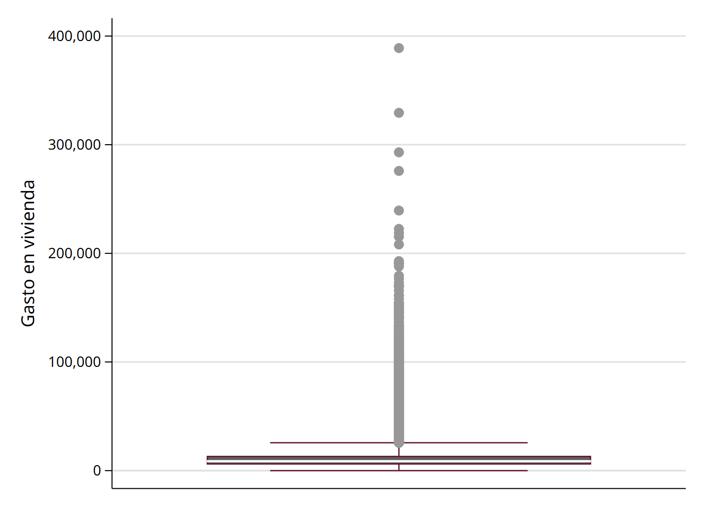{#fig-truncamiento-antes}

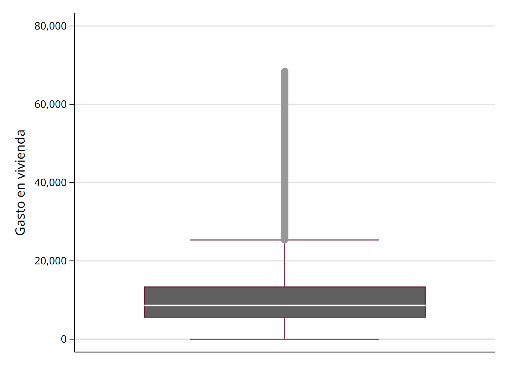{#fig-truncamiento-despues}

Truncamiento de los datos, ENIGH 2024
:::

## Anexo V. Valor Monetario de Canastas {#sec-anexo-v}

El cuadro siguiente reúne el valor monetario mensual de cada componente de la Canasta Digna y el Salario Digno resultante, por entidad federativa y ámbito (urbano y rural). El renglón nacional encabeza el cuadro y antecede a las entidades en orden alfabético. La Canasta Alimentaria y la Canasta NANV se expresan por persona; la Canasta de Vivienda corresponde al hogar; el Salario Digno es el monto neto por persona trabajadora.

```{r}
#| label: tbl-valor-monetario
#| echo: false
#| message: false
#| warning: false
#| tbl-cap: "Valor monetario mensual de las canastas y Salario Digno por entidad y ámbito."

pacman::p_load(dplyr, tidyr, knitr, kableExtra)

money <- function(x) paste0("$", format(round(x, 2), big.mark = ",", nsmall = 2))

vm <- sd |>
  transmute(cve_ent, nom_ent, ambito,
            alim = canasta_alimentos, viv = vivienda_mensual,
            nanv = NANV, sald = salario_digno) |>
  pivot_wider(names_from = ambito,
              values_from = c(alim, viv, nanv, sald))

# Nacional (cve_ent 33) hasta arriba; entidades en orden alfabético oficial (cve_ent 1-32).
vm <- bind_rows(
  vm |> filter(cve_ent == 33),
  vm |> filter(cve_ent != 33) |> arrange(cve_ent)
)

tab <- vm |>
  transmute(nom_ent,
            alim_Urbano, viv_Urbano, nanv_Urbano, sald_Urbano,
            alim_Rural,  viv_Rural,  nanv_Rural,  sald_Rural) |>
  mutate(across(-nom_ent, money))

col_nm <- c("Entidad",
            "Canasta Alimentaria", "Canasta de Vivienda (Hogar)", "Canasta NANV", "Salario Digno",
            "Canasta Alimentaria", "Canasta de Vivienda (Hogar)", "Canasta NANV", "Salario Digno")

kbl(tab, booktabs = TRUE, longtable = TRUE, col.names = col_nm,
    align = c("l", rep("r", 8))) |>
  kable_styling(latex_options = "repeat_header", font_size = 8, full_width = FALSE) |>
  add_header_above(c(" " = 1, "Urbano" = 4, "Rural" = 4)) |>
  column_spec(1, width = "2.6cm") |>
  column_spec(2:9, width = "1.8cm") |>
  row_spec(1, bold = TRUE) |>
  footnote(general = "Pesos de agosto de 2024. Fuente: elaboración propia con datos de la ENIGH 2024.",
           general_title = "", footnote_as_chunk = TRUE) |>
  landscape()
```

## Anexo VI. Productos en la Canasta Alimentaria {#sec-anexo-vi}

Los cuadros siguientes enumeran los productos que integran la Canasta Alimentaria en cada ámbito. Se incluyen los bienes seleccionados por su incidencia de consumo en el estrato de referencia (al menos 10% de los hogares en el ámbito urbano y 8% en el rural). Para cada producto se reporta su clave de la ENIGH 2024, el concepto, la cantidad mensual por persona (mediana ponderada del estrato de referencia) y la unidad de medida.

### Canasta alimentaria urbana

| Clave | Concepto | Cantidad | Unidad |
| --- | --- | --- | --- |
| 011111 | Arroz en grano | 1 | kg |
| 011131 | Tortillas de maíz | 1 | kg |
| 011132 | Tortillas de harina de trigo | 0.5 | kg |
| 011133 | Pan | 0.36 | kg |
| 011134 | Pan de caja | 0.62 | kg |
| 011135 | Galletas dulces | 0.207 | kg |
| 011137 | Pan dulce a granel | 0.35 | kg |
| 011150 | Spaghetti, pastas italianas y pastas para sopa | 0.22 | kg |
| 011192 | Tostadas | 0.36 | kg |
| 011221 | Bistec de res | 1 | kg |
| 011224 | Molida de res | 0.75 | kg |
| 01122F | Pollo entero o en piezas (excepto pierna, muslo y pechuga) | 1 | kg |
| 011231 | Jamón de puerco | 0.25 | kg |
| 011252 | Chorizo de puerco | 0.5 | kg |
| 011411 | Leche entera fresca | 1 | lt |
| 011433 | Crema | 0.26 | kg |
| 011451 | Queso fresco | 0.25 | kg |
| 011454 | Queso Oaxaca o asadero | 0.3 | kg |
| 011460 | Yogurt y bebidas fermentadas a base de leche | 0.88 | lt |
| 011481 | Huevo de gallina | 1 | kg |
| 011512 | Otros aceites vegetales comestibles | 1 | lt |
| 011592 | Chicharrón | 0.25 | kg |
| 011611 | Aguacate | 0.5 | kg |
| 011616 | Otros plátanos: Chiapas, dominico, guineo, manzano, dorado, portalimón y Roatán | 1 | kg |
| 011621 | Limón | 1 | kg |
| 011633 | Manzana y perón | 1 | kg |
| 011712 | Lechuga | 0.5 | kg |
| 011721 | Calabaza | 1 | kg |
| 011722 | Chayote | 0.79 | kg |
| 011725 | Chile serrano | 0.25 | kg |
| 011727 | Jitomate (tomate rojo) | 1 | kg |
| 011728 | Pepino | 1 | kg |
| 011729 | Tomate verde | 1 | kg |
| 011743 | Cebolla | 0.5 | kg |
| 011746 | Nopal | 0.6 | kg |
| 011748 | Zanahoria | 0.5 | kg |
| 011751 | Papa | 1 | kg |
| 011761 | Frijol en grano | 1 | kg |
| 011797 | Frijol procesado | 0.5 | kg |
| 011810 | Azúcar | 1 | kg |
| 011911 | Alimentos preparados, enlatados, congelados o empacados, listos para consumirse | 1 | pieza |
| 011942 | Cilantro | 0.1 | kg |
| 012100 | Jugos de frutas o verduras envasados | 1 | lt |
| 012201 | Café soluble | 0.085 | kg |
| 012501 | Agua natural embotellada | 20 | lt |
| 012601 | Refrescos sabor cola | 2 | lt |
| 012602 | Refrescos de otros sabores | 2 | lt |
| 111111 | Desayunos | 1 | pieza |
| 111112 | Comidas | 2 | pieza |
| 111113 | Cenas | 2 | pieza |
| 111124 | Otros alimentos cocinados para su consumo inmediato | 1.5 | pieza |
| 111126 | Pollos rostizados | 1 | pieza |
| 181124 | Pierna, muslo o pechuga de pollo con hueso | 1 | kg |
| 181125 | Pierna, muslo o pechuga de pollo sin hueso | 1 | kg |
| 181126 | Chorizo de pollo, jamón de pollo, pavo y otras aves; nuggets de pollo y otras aves, salchicha, mortadela, tocino de pollo, pavo y otras aves, etcétera. | 0.333 | kg |
| 181134 | Plátano verde y Tabasco | 1 | kg |

*Fuente: elaboración propia con datos de la ENIGH 2024.*

### Canasta alimentaria rural

| Clave | Concepto | Cantidad | Unidad |
| --- | --- | --- | --- |
| 011111 | Arroz en grano | 1 | kg |
| 011131 | Tortillas de maíz | 1 | kg |
| 011132 | Tortillas de harina de trigo | 0.5 | kg |
| 011133 | Pan | 0.3 | kg |
| 011134 | Pan de caja | 0.62 | kg |
| 011135 | Galletas dulces | 0.185 | kg |
| 011137 | Pan dulce a granel | 0.35 | kg |
| 011150 | Spaghetti, pastas italianas y pastas para sopa | 0.22 | kg |
| 011192 | Tostadas | 0.36 | kg |
| 011221 | Bistec de res | 1 | kg |
| 011224 | Molida de res | 0.7 | kg |
| 011228 | Costillas y chuleta de puerco | 1 | kg |
| 01122F | Pollo entero o en piezas (excepto pierna, muslo y pechuga) | 1 | kg |
| 011231 | Jamón de puerco | 0.25 | kg |
| 011252 | Chorizo de puerco | 0.4 | kg |
| 011322 | Atún enlatado | 0.28 | kg |
| 011411 | Leche entera fresca | 1 | lt |
| 011433 | Crema | 0.25 | kg |
| 011451 | Queso fresco | 0.35 | kg |
| 011454 | Queso Oaxaca o asadero | 0.275 | kg |
| 011460 | Yogurt y bebidas fermentadas a base de leche | 0.66 | lt |
| 011481 | Huevo de gallina | 0.6 | kg |
| 011512 | Otros aceites vegetales comestibles | 1 | lt |
| 011592 | Chicharrón | 0.25 | kg |
| 011611 | Aguacate | 0.5 | kg |
| 011616 | Otros plátanos: Chiapas, dominico, guineo, manzano, dorado, portalimón y Roatán | 1 | kg |
| 011621 | Limón | 0.7 | kg |
| 011633 | Manzana y perón | 1 | kg |
| 011712 | Lechuga | 0.6 | kg |
| 011721 | Calabaza | 1 | kg |
| 011722 | Chayote | 0.6 | kg |
| 011723 | Chile jalapeño | 0.5 | kg |
| 011725 | Chile serrano | 0.25 | kg |
| 011727 | Jitomate (tomate rojo) | 1 | kg |
| 011728 | Pepino | 1 | kg |
| 011729 | Tomate verde | 1 | kg |
| 011743 | Cebolla | 0.5 | kg |
| 011748 | Zanahoria | 0.5 | kg |
| 011751 | Papa | 1 | kg |
| 011761 | Frijol en grano | 1 | kg |
| 011796 | Papas fritas en bolsa o a granel | 0.153 | kg |
| 011810 | Azúcar | 1 | kg |
| 011911 | Alimentos preparados, enlatados, congelados o empacados, listos para consumirse | 1 | pieza |
| 011942 | Cilantro | 0.1 | kg |
| 012100 | Jugos de frutas o verduras envasados | 1 | lt |
| 012201 | Café soluble | 0.1 | kg |
| 012501 | Agua natural embotellada | 20 | lt |
| 012601 | Refrescos sabor cola | 2 | lt |
| 012602 | Refrescos de otros sabores | 2 | lt |
| 111111 | Desayunos | 1 | pieza |
| 111112 | Comidas | 1 | pieza |
| 111113 | Cenas | 1 | pieza |
| 111124 | Otros alimentos cocinados para su consumo inmediato | 1.5 | pieza |
| 111126 | Pollos rostizados | 1 | pieza |
| 181124 | Pierna, muslo o pechuga de pollo con hueso | 1 | kg |
| 181125 | Pierna, muslo o pechuga de pollo sin hueso | 1 | kg |
| 181126 | Chorizo de pollo, jamón de pollo, pavo y otras aves; nuggets de pollo y otras aves, salchicha, mortadela, tocino de pollo, pavo y otras aves, etcétera. | 0.3 | kg |
| 181134 | Plátano verde y Tabasco | 1 | kg |

*Fuente: elaboración propia con datos de la ENIGH 2024.*

## Anexo VII. Evaluación del supuesto para la Canasta NANV {#sec-anexo-vii}

La Canasta NANV representa el gasto mensual en bienes y servicios distintos de alimentos y vivienda (por ejemplo: salud, educación, transporte y otros servicios básicos) que se considera necesario para una vida digna. Para estimarla se recurre a la curva de Engel del gasto en vivienda[^engel-vivienda]: el supuesto fundamental es que los hogares que destinan a vivienda una cantidad acorde con los estándares de habitabilidad tienden, en promedio, a realizar también un gasto apropiado en el resto de los rubros no alimentarios.

[^engel-vivienda]: Es decir, a la relación entre el gasto en vivienda per cápita y la distribución de probabilidad acumulada del gasto corriente total.

De forma implícita se asume también que la vivienda y los demás gastos no alimentarios son bienes normales, es decir, con elasticidad-ingreso positiva. Así, el nivel de gasto en vivienda funciona como indicador del bienestar general del hogar pues a mayor capacidad económica, mayor gasto tanto en vivienda como en los demás componentes. En cambio, el gasto en alimentos tiene una elasticidad-ingreso menor que la vivienda, por lo que esta última resulta un mejor indicador del gasto no alimentario digno.

Para comprobar que ambos supuestos son válidos se realizaron dos ejercicios de validación empírica con los microdatos de la ENIGH 2024. El primero consistió en estimar las elasticidades-ingreso del gasto en alimentos, vivienda y NANV mediante dos métodos paramétricos. Un modelo logarítmico ponderado por el diseño muestral de la encuesta y el método de Working-Leser, que infiere la elasticidad a partir de la participación de cada rubro en el gasto total. Ambos enfoques coinciden y sus resultados son robustos a distintas especificaciones: las elasticidades de vivienda y NANV son positivas y estadísticamente significativas en los tres ámbitos analizados (nacional, urbano y rural), con valores que oscilan entre `r rng_eta("vivienda")` para vivienda, y entre `r rng_eta("NANV")` para NANV. La elasticidad superior a uno del gasto NANV indica que su participación en el presupuesto familiar crece conforme aumentan los ingresos y el bienestar. Los alimentos, en contraste, presentan una elasticidad inferior a uno (entre `r rng_eta("alimentos")`), patrón consistente con la Ley de Engel [@anker2011engel] que confirma que la vivienda es un indicador más sensible del bienestar global del hogar que la alimentación (@fig-elasticidades). 

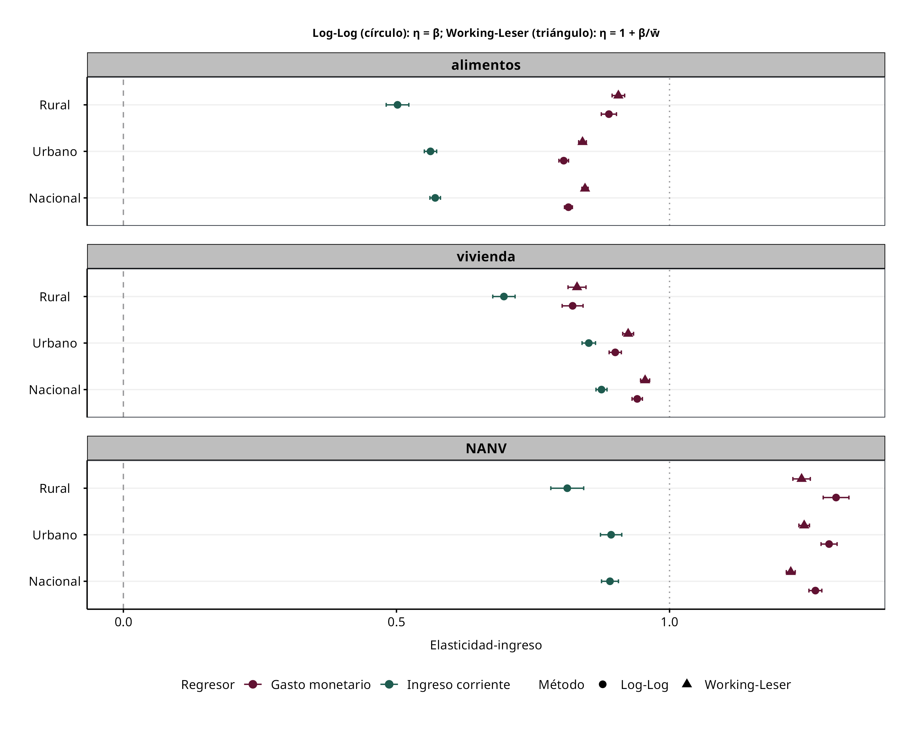{#fig-elasticidades}

En el segundo ejercicio se verificó que los hogares de referencia utilizados para calcular el gasto NANV correspondan a condiciones de vida dignas. Para ello se compararon tres grupos: los hogares ubicados por debajo del umbral NANV, los hogares del estrato de referencia del componente alimentario y los hogares NANV. Los resultados muestran que los hogares NANV presentan un perfil de bienestar multidimensional (medido con los indicadores de acceso a agua, calidad de los materiales de construcción, hacinamiento, saneamiento, educación y seguridad alimentaria) prácticamente idéntico al del estrato de referencia alimentario y notablemente superior al de los hogares por debajo del umbral. En promedio, los hogares NANV cumplen `r fmt2(bg("hogares_nanv", indice_promedio))` de los cuatro indicadores estructurales del índice de bienestar, cifra casi idéntica a la del estrato de referencia alimentario (`r fmt2(bg("estrato_ref_alim", indice_promedio))`) y muy por encima de la de los hogares por debajo del umbral (`r fmt2(bg("percentiles_menores_nanv", indice_promedio))`). El acceso a saneamiento, por ejemplo, pasa de `r fmt_pct(bg("percentiles_menores_nanv", pct_i_saneamiento)/100)` en los hogares por debajo del umbral a `r fmt_pct(bg("hogares_nanv", pct_i_saneamiento)/100)` en los hogares NANV (@fig-bienestar-nanv). Esto es una prueba de validez interna de la metodología pues los hogares de los que se deriva el gasto NANV de referencia cumplen con los criterios de dignidad.

::: {#fig-bienestar-nanv layout-ncol="1"}
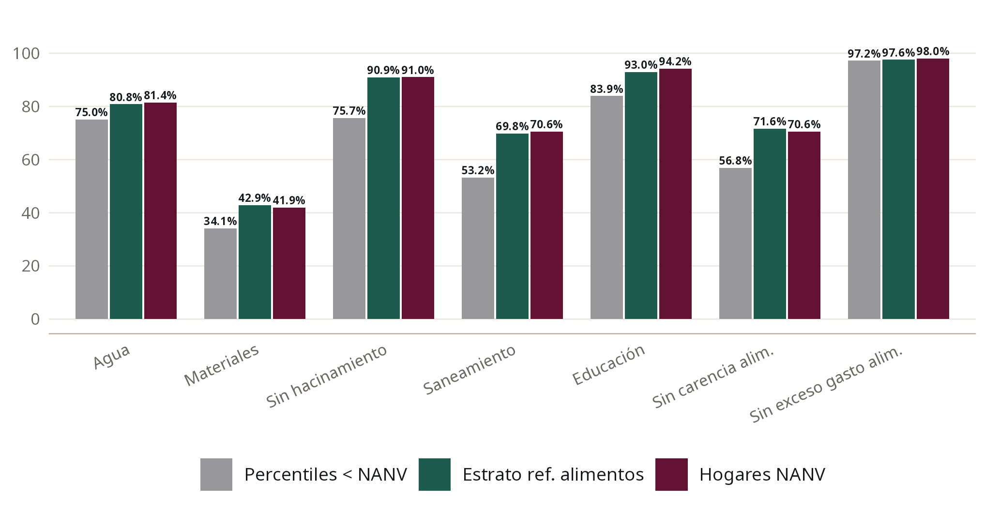{#fig-bienestar-indicadores}

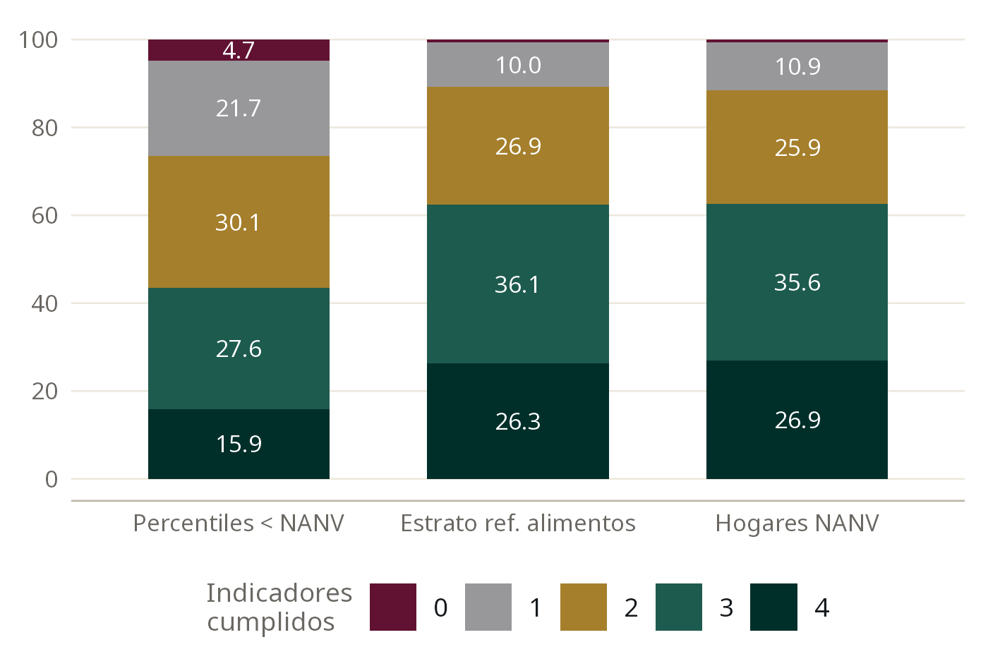{#fig-bienestar-indice}

Indicadores de bienestar de los hogares por debajo del umbral NANV, del estrato de referencia alimentario y de los hogares NANV
:::

En conjunto, los dos ejercicios de validación respaldan la solidez metodológica del supuesto NANV. Las estimaciones de elasticidad-ingreso confirman que el gasto en vivienda y en NANV son bienes normales con elasticidades positivas y estadísticamente significativas, mientras que el gasto en alimentos exhibe una elasticidad inferior a la unidad, consistente con la Ley de Engel [@anker2011engel]. Esto justifica que el nivel de gasto en vivienda se use como referencia para inferir el gasto NANV digno, pues la vivienda captura las variaciones del bienestar económico de los hogares con mayor sensibilidad que la alimentación. El análisis de bienestar multidimensional, por su parte, muestra que los hogares del estrato de referencia NANV presentan condiciones de vida prácticamente equivalentes a las del estrato de referencia alimentario y claramente superiores a las de los hogares situados por debajo del umbral. Ambos resultados son consistentes entre sí y con los principios teóricos que sustentan la metodología, lo que permite concluir que el gasto NANV derivado de la curva de Engel de vivienda constituye una estimación confiable del gasto mensual promedio en bienes y servicios no alimentarios necesarios para una vida digna.

## Anexo VIII. Comparación de ámbito rural y urbano {#sec-anexo-viii}

La Ciudad de México es una entidad en la que el valor estimado de la Canasta NANV en el ámbito rural ($`r fmt(nanv_cdmx_rur)`) supera al urbano ($`r fmt(nanv_cdmx_urb)`), lo que refleja una mayor dificultad para que los hogares rurales cubran sus necesidades no alimentarias ni de vivienda. En la @fig-percentiles-nanv se observa que, en la Ciudad de México, el percentil de referencia urbano es menor que el rural: dentro de la distribución del gasto corriente de cada ámbito, los hogares con viviendas dignas en zonas urbanas registran un gasto corriente relativamente menor que los de zonas rurales. La @fig-cdmx-scam muestra el comportamiento del modelo estimado por ámbito e identifica a los hogares que habitan viviendas dignas y a los que no.

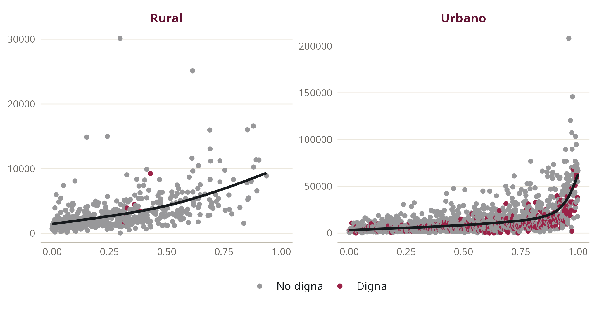{#fig-cdmx-scam}

Ambos modelos muestran una relación positiva entre el alquiler per cápita y la probabilidad acumulada del gasto corriente, un comportamiento deseable y consistente. Sin embargo, la cantidad de hogares con viviendas dignas en el ámbito rural es considerablemente menor que en el urbano. Como se aprecia en la @fig-cdmx-radar, las viviendas del ámbito rural de la Ciudad de México incumplen sobre todo el criterio de disponibilidad, centrado en el acceso a servicios básicos.

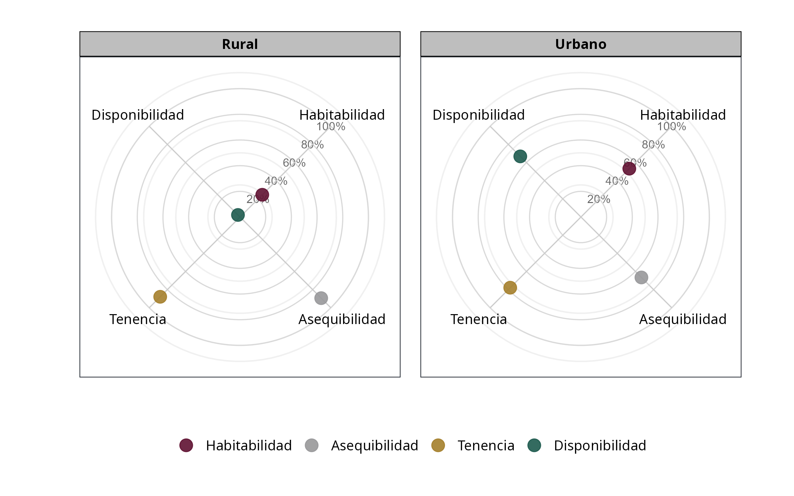{#fig-cdmx-radar}

Tanto el comportamiento adecuado del modelo monotónico como la persistencia de las carencias en el acceso a servicios básicos de vivienda orientan a concluir que el mayor monto estimado en la Canasta NANV refleja adecuadamente la mayor necesidad de acceso a servicios en el ámbito rural de la Ciudad de México frente al urbano.

## Anexo IX. Actualización de la Canasta Digna {#sec-anexo-ix}

Los valores monetarios reportados para los tres componentes de la Canasta Digna – Alimentos, Vivienda y NANV – se encuentran a precios de agosto del 2024, fecha del levantamiento de la ENIGH 2024. Para actualizar sus valores se construyeron deflactores para cada componente. En el caso de la **Canasta Alimentaria** se usaron los subíndices por entidad del INPC por objeto del gasto para deflactar el valor estimado del consumo en cada producto de las canastas urbana y rural. Para obtener el valor actualizado de la Canasta Alimentaria se siguen las siguientes fórmulas:

$$\text{Valor del consumo}_{ij} = \text{Precio}_{ij}^{\text{ago2018}} \cdot \text{Cantidad}_i$$

Se comienza estimando el valor del consumo en el producto $i$ en la entidad $j$ como el producto entre su precio y la cantidad establecida en su respectiva canasta. El valor actualizado se obtiene como:

$$\text{Valor actualizado}_{ij}^{t} = \text{Valor del consumo}_{ij} \cdot \frac{\text{INPC}_{ij}^{t}}{\text{INPC}_{ij}^{\text{ago2018}}}$$

El valor actualizado al periodo $t$ en el consumo del producto $i$ de la ciudad $j$ es igual al producto entre su valor a precios de agosto del 2018 y el deflactor. Por último, el valor de la Canasta alimentaria es:

$$\text{Canasta alimentaria}_{j}^{t} = \sum_{i} \text{Valor actualizado}_{ij}$$

La Canasta Alimentaria de la entidad $j$ para el período $t$ es igual a la suma de los valores actualizados de cada producto en la respectiva canasta. El valor de las Canastas de **Vivienda** y **NANV** se actualiza con el subíndice de vivienda y con el índice general del INPC, respectivamente. Con las siguientes fórmulas:

$$\text{Canasta}_{j}^{t} = \text{Canasta}_{j}^{\text{ago2018}} \cdot \frac{\text{INPC}_{j}^{t}}{\text{INPC}_{j}^{\text{ago2018}}}$$

El valor actualizado de las canastas en la entidad $j$ para el periodo $t$ es igual al producto entre el valor a precios de agosto de 2018 y su respectivo deflactor. La @fig-serie-salario presenta la serie de tiempo resultante del valor monetario del Salario Digno nacional por ámbito.

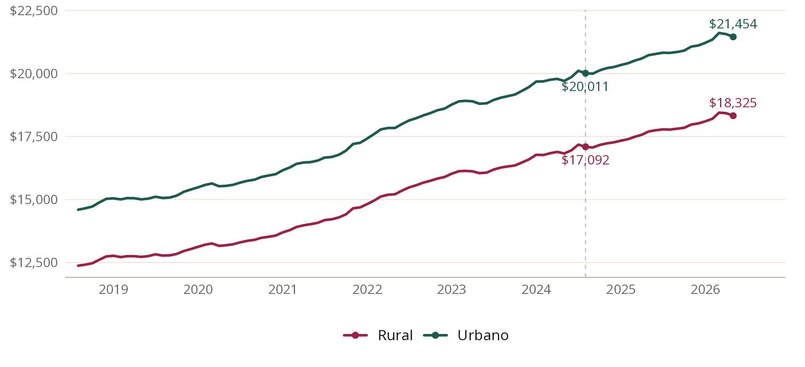{#fig-serie-salario}
